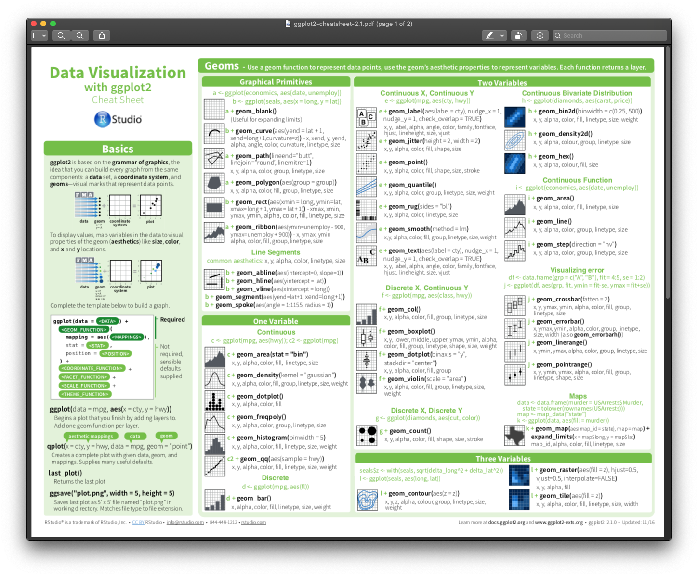
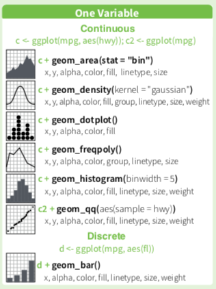

<big>

```{r, include=FALSE, message=F, warning=F}
library("knitr")
opts_chunk$set(echo = TRUE)
```

---

## Agenda {-}

* Loading data
* Data exploration
* Plotting
* Descriptive statistics

---

## The data: LIPP {-}

For this part of the workshop we will be working with data from Dr. Rosen's The Languages in the Prairies Project (LIPP) corpus, which documents language use in the Prairie provinces. We will focus on data collected in interviews with Winnipeg residents who are either migrants from the Philippines, or who have Filipino ancestry. Of course, all of the techniques we will be using could apply to any type of linguistic (or other) data.

---

# Loading the data

First, we will install and load the `tidyverse` R package. We will also install/load a package called `viridis`. This is special colour palette, for use in making plots:

>*"This color map is designed in such a way that it will analytically be perfectly perceptually-uniform, both in regular form and also when converted to black-and-white. It is also designed to be perceived by readers with the most common form of color blindness."*

As I have a common form of colour blindness (red/green), I find a lot of plots made with R's default colour palette to be really hard to read. Viridis solves a lot of those problems.

```{r, message=F, warning=F}
if(!require(tidyverse)){install.packages("tidyverse")}
library(tidyverse)

if(!require(viridis)){install.packages("viridis")}
library(viridis)
```

Next we will load the prepared LIPP data file. This is an excerpt of data which was output from the Forced Alignment and Vowel Extraction (FAVE) program suite - I have selected just some of the variables in the original dataset and anonymized the information. The file, which is in the main workshop folder from GitHub, is saved as a .csv (comma-separated values), a commonly-used text-based spreadsheet format.

To load the LIPP data we will use the `read_csv` function from the tidyverse and store the data as an R object simply named `LIPP`. This is done with the "assignment operator" which looks like a leftward-facing arrow. You can type the characters `<` and `-` to enter this, or use the shortcut `<Alt/Option> -`.

>**Note:** it is also possible to put an equals sign `=` instead of the assignment operator. I do *not* recommend getting in the habit of doing this for a few reasons. #1 the assignment operator indicates the direction of the assignment: the information on the *right* is assigned to the object on the *left*. And #2 the double equals sign `==` is used to check data values, and this is easily confused with `=` if you're not careful.

``` {r}
LIPP <- read_csv("LIPP.csv")
```

R objects are sets of information stored in R's working memory. These are visible in the Environment tab (default position: top right pane). 

The `read_csv` function puts the data into a `tidyverse` data table type called a `tibble`. 

>R uses a variety of types of objects, several of which are arranged as data frames or tables, similar to a spreadsheet in Excel. There are a number of differences between these which can cause problems depending on what kind of data you are putting into them and what you plan to do with the data after. `Tibbles` are designed to avoid a lot of these problems.

After storing the data in the `LIPP` object, we get some feedback in the form of a list of all of the columns (variables) in the data. Each variable name is listed as one of two types of variables. A `double` is a real number which may or may not have a decimal, i.e. some value that was measured quantitatively. A `character` is some text-based value, which usually represents some level of a categorical variable, such as language spoken, or type of vowel.

# Exploring the data

We will run through a few ways of investigating a dataset such as the LIPP .csv which we loaded earlier as `LIPP`. we'll start by focusing on F2, the second vowel formant which is correlated with vowel front-to-back position, with higher F2 values indicating a more forward position.

There are a *lot* of ways to explore the data, and there's really no right or wrong place to begin. It really depends what kind of question you are trying to answer. Let's say you were interested in seeing, on average, how far forward the average vowel articulation was in the data, which would be correlated with F2. We could get the mean of all the F2 values:

```{r}
mean(LIPP$F2)
```

This is the basic format for a lot of simple functions dealing with a data table of some sort: `FUNCTION(OBJECT$VARIABLE)`. The parentheses and the `$` operator are key elements of R code that you will see over and over.

## Data distribution

To begin, let's look at the distribution of F2 across all speakers and all vowels. F2 is measured in Hz and, because it could potentially have any (positive) value, is a *continuous* variable. A histogram is a common way to examine continuous variables, so let's see 2 ways to make one. The first involves the 'quick-plot' function `qplot()`, which takes limited input and is intended for producing plots when you just want to see the results quickly but don't care so much about tweaking the details. All you need to do is enter the names of the `data table` and the `variable`, separated by a `$`.

``` {r}
qplot(LIPP$F2)
```

We get a warning about selecting a better 'binwidth', which is the numerical width of the 'bins' which the F2 values are sorted into, and that make up the stacked columns of the histogram. We can safely ignore this for the time being.

`qplot` allows another way to enter the data as well (and a lot of other functions use this format): list the variable alone, and the data object separately:

``` {r}
qplot(F2, data = LIPP)
```

This produces ths same output as before, with the exception of the label on the x-axis.

The second histogram plotting method involves putting one function inside another. The base plot function is `ggplot()` which was introduced before. If we only specified the data object, we get this:

```{r}
ggplot(data = LIPP)
```

Just a blank plot. We need to add the variable we want to map using the `aes()` function, which goes *inside* the `ggplot()` function.

>`aes()` stands for "aesthetic", the tidyverse term for the mapping of data onto visual elements such as coordinates, colours, shapes, etc.

```{r}
ggplot(data = LIPP, aes(x = F2))
```

This plot is not completely blank - we have some numbers on the x-axis and grid markers, but there is no data. The final step is to add one of the many `geom_` functions available in `ggplot()`. `qplot()` automatically tries to select an appropriate `geom_`, but `ggplot()` does not. In this case we want a histogram, which is generated with `geom_histogram()`. The way that `geom_`s and other plot elements are added in `ggplot()` is by placing them in sequence separated by a `+`. 

>From my understanding, this type of structure, with `ggplot()` elements separated by `+`, is probably going to change at some point in the future, but don't quote me on that.

``` {r}
ggplot(data = LIPP, aes(x = F2)) +
  geom_histogram()
```

This produces a 100% identical plot to the (second) one we made with `qplot()` earlier. We also get the same warning here because we didn't specify any bin width, but we can now do so. Let's choose '50', i.e. every 50 Hz will be in a different bin. This is done inside the `geom_histogram()` function using the `binwidth` argument.

``` {r}
ggplot(data = LIPP, aes(x = F2)) +
  geom_histogram(binwidth = 50)
```

As an aside, you can find out all of the available options and structures for a given function by either entering it in the search box at the upper right of Rstudio, or by typing a `?` followed by the name of the function at the prompt in the Console. This will pull up the Description page for that function under the Help tab in the upper right.

```{r}
?ggplot
```

There are a **lot** of `geom_`s available in `ggplot()`:

```{r}

```

Since we are plotting one variable which is continuous, let's focus on the available `geom_`s for that option:

```{r}

```

The *frequency polygon*, which works much like a histogram but produces a contour outline of the data distribution rather than stacked bins, although it still *uses* the binwidth argument. Setting a reasonably fine-grained binwidth produces a smooth contour outline.

``` {r}
ggplot(data = LIPP, aes(x = F2)) +
  geom_freqpoly(binwidth = 50)
```

>Try changing the binwidth settings in the histogram and frequency polygon plots to produce different visual mappings. You can *drastically* change the plot output by doing so.

Another similar `geom_` is the `geom_area()` plot. This function maps data using a variety of `stat`s for different purposes - we will specify "bin" in this case so the data is "binned" in the same way that it is for a histogram.

``` {r}
ggplot(data = LIPP, aes(x = F2)) +
  geom_area(stat = "bin", binwidth = 50)
```


It's generally thought that men's and women's voices differ in frequency, which affects not only fundamental frequency (i.e. pitch) but also the upper harmonics, which vowel formants consist of. Does our data reflect this? One way to tell is to 'facet' the separate distributions for each sex.

>**Note:** Like a lot of linguistic corpora, LIPP divides speakers according to sex/gender into male and female, under the implicit assumption that sex and gender are a singular, binary social category. While there has been some work done in fields such as sociolinguistics to question this assumption, in all honesty it hasn't progressed very far, and even researchers (such as myself) who are prepared to accept that this assumption is wrong, or at least should be interrogated, are often unsure about specifically how this could better be dealt with. Until we have a better answer, and given that there isn't a consensus around this, I will present the LIPP data 'as-is'.

To facet our data by some variable, we add the `facet_wrap()` function under the `ggplot` call. Inside this, we put a tilde followed by the variable we wish to facet by.

>If you are wondering if you can facet by more than one variable, the answer is yes!

``` {r}
ggplot(data = LIPP, aes(x = F2)) +
  geom_freqpoly(binwidth = 50) +
  facet_wrap(~ sex) +
  theme_light()
```

It looks like these distributions are different, but we could have a better visual sense of this if we overlaid them on top of each other. We can do this by simply telling `ggplot` to differentiate the colour 'aesthetic mapping' according to the `sex` variable, rather than faceting the data. Sometimes you need to play around with some of the different options in order to determine the best visualization method for what you are trying to display.

>**Note:** I have a form of colour blindness which makes it very difficult for me to clearly distinguish a lot of the colours commonly present in plots. All of my examples here will use the ``scale_colour_viridis_d()`` function from the ``viridisLite`` R package, which is designed to *"provide colour maps that are perceptually uniform in both colour and black-and-white. They are also designed to be perceived by viewers with common forms of colour blindness"*. It can still be hard to distinguish large numbers of categories even with this method (see the vowels example below), but it's still better than a lot of the alternatives.

``` {r F2sex}
ggplot(data = LIPP, aes(x = F2, colour=sex)) +
  geom_freqpoly(binwidth = 50) +
  scale_colour_viridis_d() +
  theme_light()
```

We can see pretty clearly here that the male and female speakers do have different distributions for F2, although the male distribution falls almost entirely inside the female distribution.

Just out of curiosity, what if we applied the colour aesthetic mapping to the `vowel` variable instead?

``` {r}
ggplot(data = LIPP, aes(x = F2, colour=vowel)) +
  geom_freqpoly(binwidth = 50) +
  scale_colour_viridis_d() +
  theme_light()
```

We can see that each vowel has, as we might well expect, a unique distribution of F2 values. We'll come back to look at vowel differences later on.

## *t*-tests

Having observed earlier that the male & female speakers appear to have different F2 distributions, we might want to formally test this. A *t*-test is probably the simplest method for doing so, and is appropriate here because we are looking at one continuous variable, F2 values, across two groups. We provide it with the two sets of data for F2, split by speaker sex, and it determines whether there is reason to reject the null hypothesis, which would be the assumption that the two distributions are statistically identical. *t* values greater than +/- 1.96 are considered significant.

``` {r}
t.test(x = LIPP$F2[LIPP$sex == "male"], 
       y = LIPP$F2[LIPP$sex == "female"])
```

Because the *t* value is quite large and the *p* value is extremely small, we can comfortably reject the null hypothesis, and conclude that the LIPP male vs. female F2 distributions are substantially (*t* value) and significantly (*p* value) different from each other.

## Boxplots and descriptive statistics

Let's look at these two distributions in a boxplot. These are a type of plot used to highlight certain key aspects of a distribution. Boxplots expect to be provided one continuous variable (often plotted on the *y*-axis) and one categorical variable (on the *x*-axis) -- sometimes, there may be just one set of data, in which case there is no categorical variable to divide the data by.

``` {r}
ggplot(data = LIPP, aes(y = F2, x = sex)) +
  geom_boxplot() +
  scale_colour_viridis_d() +
  theme_light()
```

What is indicated in the boxplot? The rectangular box itself contains the central 50% quantity of the distribution, and the central line indicates the median (not the mean!) value, i.e. the value exactly in the centre of the data. The two extended lines or "whiskers" mark the range of the distribution beyond which observations are considered to be "outliers", which are marked with dots. The whiskers are each 1.5 times the distance of the box itself, i.e. 1.5 times the central 50% of the range (this is the interquartile range or IQR). Note that there appear to be a lot more high-frequency outliers than low-frequency ones, for both males and females.

Overall, the two distributions look pretty similar to each other, but the female speakers' frequencies are shifted higher by 200-300 Hz. This both fits with our intuition and knowledge about sex-based speech differences, and our previous examination of the data.

By the way, if you just want to capture some of the basic numerical descriptors regarding your data, the ``summary()`` function is pretty useful. This provides statistical values including the minimum, maximum, median and mean values, as well as the 1st and 3rd quantiles, which define the outer boundaries of the box in a boxplot. If you just want the quantiles, ``quantile()`` gives you all of that except the mean -- recall that the mean is actually not part of a boxplot, so this is a more accurate representation of the numerical data related to that type of plot.

```{r}
summary(LIPP$F2)
quantile(LIPP$F2)
```

We can also look at our two sex/gender groups individually.

```{r}
summary(LIPP$F2[LIPP$sex == "male"])
```

```{r}
summary(LIPP$F2[LIPP$sex == "female"])
```

We can readily see that all of the values skew higher for the female speakers. This is the same result we saw in the boxplots earlier, put into numerical form. Personally, I rarely start with summarizing my data numerically like this, as I find a visual analysis far easier to grasp quickly. But numerical values are certainly useful and necessary in reporting your data later.

## Exercises

1. What other variables in the data could we perform *t*-tests on? Try running some of them using the previous code as an example.

1. What kinds of things can you *not* do with the *t*-test? Try to think of some questions that you wouldn't be able to answer using the things we've looked at so far.

</big>