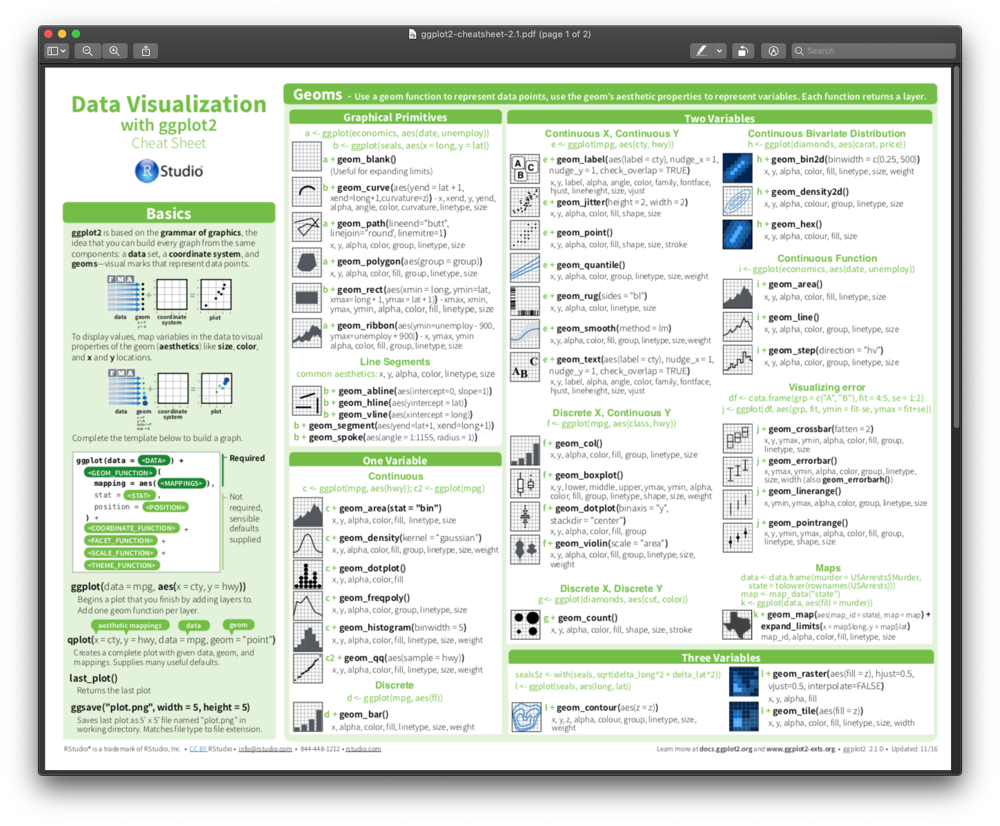
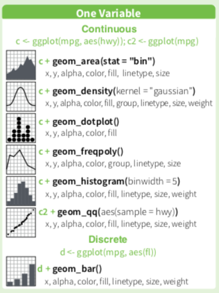

<big>

```{r, include=FALSE, message=F, warning=F}
library("knitr")
opts_chunk$set(echo = TRUE)
```

---

## Agenda {-}

* Loading data
* Data exploration
* Plotting

---

## The data: LIPP {-}

For this part of the workshop we will be working with data from Dr. Rosen's The Languages in the Prairies Project (LIPP) corpus, which documents language use in the Prairie provinces. We will focus on data collected in interviews with Winnipeg residents who are either migrants from the Philippines, or who have Filipino ancestry. Of course, all of the techniques we will be using could apply to any type of linguistic (or other) data.

---

# Loading the data

First, we will install and load the `tidyverse` R package. We will also install/load a package called `viridis`. This is special colour palette, for use in making plots:

>*"This color map is designed in such a way that it will analytically be perfectly perceptually-uniform, both in regular form and also when converted to black-and-white. It is also designed to be perceived by readers with the most common form of color blindness."*

As I have a common form of colour blindness (red/green), I find a lot of plots made with R's default colour palette to be really hard to read. Viridis solves a lot of those problems.

```{r, message=F, warning=F}
if(!require(tidyverse)){install.packages("tidyverse")}
library(tidyverse)

if(!require(viridis)){install.packages("viridis")}
library(viridis)
```

Next we will load the prepared LIPP data file. This is an excerpt of data which was output from the Forced Alignment and Vowel Extraction (FAVE) program suite - I have selected just some of the variables in the original dataset and anonymized the information. The file, which is in the main workshop folder from GitHub, is saved as a .csv (comma-separated values), a commonly-used text-based spreadsheet format.

To load the LIPP data we will use the `read_csv` function from the tidyverse and store the data as an R object simply named `LIPP`. This is done with the "assignment operator" which looks like a leftward-facing arrow. You can type the characters `<` and `-` to enter this, or use the shortcut `<Alt/Option> -`.

>**Note:** it is also possible to put an equals sign `=` instead of the assignment operator. I do *not* recommend getting in the habit of doing this for a few reasons. #1 the assignment operator indicates the direction of the assignment: the information on the *right* is assigned to the object on the *left*. And #2 the double equals sign `==` is used to check data values, and this is easily confused with `=` if you're not careful.

``` {r}
LIPP <- read_csv("LIPP.csv")
```

R objects are sets of information stored in R's working memory. These are visible in the Environment tab (default position: top right pane). 

The `read_csv` function puts the data into a `tidyverse` data table type called a `tibble`. 

>R uses a variety of types of objects, several of which are arranged as data frames or tables, similar to a spreadsheet in Excel. There are a number of differences between these which can cause problems depending on what kind of data you are putting into them and what you plan to do with the data after. `Tibbles` are designed to avoid a lot of these problems.

After storing the data in the `LIPP` object, we get some feedback in the form of a list of all of the columns (variables) in the data. Each variable name is listed as one of two types of variables. A `double` is a real number which may or may not have a decimal, i.e. some value that was measured quantitatively. A `character` is some text-based value, which usually represents some level of a categorical variable, such as language spoken, or type of vowel.

# Exploring the data

We will run through a few ways of investigating a dataset such as the LIPP .csv which we loaded earlier as `LIPP`. We can get a view of the data by simply entering the name of the object into R:

```{r}
LIPP
```

Each row represents one observation (measurement or set of measurements) and each column represents some variable. In this case, each observation is a single vowel. We can see only a few of the variables (columns) but there are many more which we can scroll through using the arrow buttons in the top row.

Columns 9-11 list the mean formant measurements for each vowel. We'll start by focusing on F2, the second vowel formant which is correlated with vowel front-to-back position, with higher F2 values indicating a more forward position.

There are a *lot* of ways to explore the data, and there's really no right or wrong place to begin. It really depends what kind of question you are trying to answer. Let's say you were interested in seeing, on average, how far forward the average vowel articulation was in the data, which would be correlated with F2. We could get the mean of all the F2 values:

```{r}
mean(LIPP$F2)
```

This is the basic format for a lot of simple functions dealing with a data table of some sort: `FUNCTION(OBJECT$VARIABLE)`. The parentheses and the `$` operator are key elements of R code that you will see over and over.

## Data distribution

To begin, let's look at the distribution of F2 across all speakers and all vowels. F2 is measured in Hz and, because it could potentially have any (positive) value, is a *continuous* variable. A histogram is a common way to examine continuous variables, so let's see 2 ways to make one. The first involves the 'quick-plot' function `qplot()`, which takes limited input and is intended for producing plots when you just want to see the results quickly but don't care so much about tweaking the details. All you need to do is enter the names of the `data table` and the `variable`, separated by a `$`.

``` {r}
qplot(LIPP$F2)
```

We get a warning about selecting a better 'binwidth', which is the numerical width of the 'bins' which the F2 values are sorted into, and that make up the stacked columns of the histogram. We can safely ignore this for the time being.

`qplot` allows another way to enter the data as well (and a lot of other functions use this format): list the variable alone, and the data object separately:

``` {r}
qplot(F2, data = LIPP)
```

This produces ths same output as before, with the exception of the label on the x-axis.

The second histogram plotting method involves putting one function inside another. The base plot function is `ggplot()` which was introduced before. If we only specified the data object, we get this:

```{r}
ggplot(data = LIPP)
```

Just a blank plot. We need to add the variable we want to map using the `aes()` function, which goes *inside* the `ggplot()` function.

>`aes()` stands for "aesthetic", the tidyverse term for the mapping of data onto visual elements such as coordinates, colours, shapes, etc.

```{r}
ggplot(data = LIPP, aes(x = F2))
```

This plot is not completely blank - we have some numbers on the x-axis and grid markers, but there is no data. The final step is to add one of the many `geom_` functions available in `ggplot()`. `qplot()` automatically tries to select an appropriate geom, but `ggplot()` does not. In this case we want a histogram, which is generated with `geom_histogram()`. The way that geoms and other plot elements are added in a `ggplot()` is by placing them in sequence separated by a `+`. 

>From my understanding, this type of structure, with `ggplot()` elements separated by `+`, is probably going to change at some point in the future, but don't quote me on that.

``` {r}
ggplot(data = LIPP, aes(x = F2)) +
  geom_histogram()
```

This produces a 100% identical plot to the (second) one we made with `qplot()` earlier. We also get the same warning here because we didn't specify any bin width, but we can now do so. Let's choose '50', i.e. every 50 Hz will be in a different bin. This is done inside the `geom_histogram()` function using the `binwidth` argument.

``` {r}
ggplot(data = LIPP, aes(x = F2)) +
  geom_histogram(binwidth = 50)
```

As an aside, you can find out all of the available options and structures for a given function by either entering it in the search box at the upper right of Rstudio, or by typing a `?` followed by the name of the function at the prompt in the Console. This will pull up the Description page for that function under the Help tab in the upper right.

```{r}
?ggplot
```

There are a **lot** of geoms to choose from:

```{r}

```

Since we are plotting one variable which is continuous, let's focus on the available geoms for that option:

```{r}

```

`geom_freqpoly` works much like a histogram but produces a contour outline of the data distribution - a *frequency polygon* - rather than stacked bins, although it still uses the binwidth argument as it is built around the same underlying data structure. Setting a reasonably fine-grained binwidth produces a smooth contour outline.

``` {r}
ggplot(data = LIPP, aes(x = F2)) +
  geom_freqpoly(binwidth = 50)
```

>Try changing the binwidth settings in the histogram and frequency polygon plots to produce different visual mappings. You can *drastically* change the plot output by doing so.

Another similar geom is the `geom_area()` plot. This function maps data using a variety of "stat"s for different purposes - we will specify the stat as "bin" in this case so the data is "binned" in the same way that it is for a histogram or frequency polygon

``` {r}
ggplot(data = LIPP, aes(x = F2)) +
  geom_area(stat = "bin", binwidth = 50)
```

It is possible to alter the shading of the area plot by adjusting the "alpha" value which ranges between 0 (fully transparent) and 1 (completely shaded).

``` {r}
ggplot(data = LIPP, aes(x = F2)) +
  geom_area(stat = "bin", binwidth = 50, alpha = 0.5)
```

Adjusting alpha in this way can be really useful when multiple data distributions are overlaid in a single plot - something we will return to.

One of the nicest features of ggplot is the ability to "facet" data. This takes a ggplot structure and divides it according a set of criteria, producing multiple sub-plots covering the various levels of whichever variable we specify. Let's see some of the variables present in the LIPP dataset:

```{r}
LIPP
```

>Only some of the rows (observations) and columns (variables) are shown, but it is possible to scroll through all of the columns using the arrow buttons in the top row.

To get a summary of the categories or levels present for a given variable, you can use the `table()` function:

```{r}
table(LIPP$sex)
```

>**Note 1:** `table()` is most effective for a categorical variable such as "language", "sex" etc. where there are a set number of discrete levels. For continuous variables, such as F1, F2, using `table()` produces very different output - try it out.

>**Note 2:** Like a lot of linguistic corpora, LIPP divides speakers according to sex/gender into *male* and *female* categories. There is and has historically been an implicit and widespread societal assumption that sex and gender are a singular, binary social category. While there has been some work done in fields such as sociolinguistics to question this assumption, in all honesty it hasn't progressed very far, and even researchers (such as myself) who are prepared to accept that this assumption is wrong are often unsure about specifically how to better deal with these categories. For the time being, and especially given that there isn't a consensus around this, I will present the LIPP data 'as-is'.

One of the questions we could ask is whether there are production differences between the voices of speakers classified as *female* or *male* in the LIPP data. One way to achieve this is to 'facet' the F2 distributions by sex.

To facet data by some variable, add the `facet_wrap()` function to the `ggplot` call. Inside `facet_wrap()`, put a period (this works as a placeholder, for reasons to be discussed below) and a tilde followed by the variable we wish to facet by.

``` {r}
ggplot(data = LIPP, aes(x = F2)) +
  geom_freqpoly(binwidth = 50) +
  facet_wrap(. ~ sex)
```

If you are wondering if you can facet by more than one variable, the answer is yes! Replace the period by some other variable, e.g. "language". This will produce sub-plots faceted by all the various combinations of sex and language:

``` {r}
ggplot(data = LIPP, aes(x = F2)) +
  geom_freqpoly(binwidth = 50) +
  facet_wrap(language ~ sex)
```

>Note that the sub-plots are arranged according to the faceting order: levels of "language" (English, Ilocano ...) occur in order, and each of these is then sub-faceted by "sex". Try reversing the order in the `facet_wrap()` function to see the alternative.

Since each sub-facet has drastically different numbers of tokens, it's hard to see how these distributions compare. An alternative geom which is more useful in this case is `geom_density`. This reports distributions in a way which relativizes differences in token counts, allowing greater ease of comparison across categories. I'll just use the original plot faceted for speaker sex here:

``` {r}
ggplot(data = LIPP, aes(x = F2)) +
  geom_density() +
  facet_wrap(language ~ sex)
```

Let's use this geom with faceting applied only to speaker sex:

``` {r}
ggplot(data = LIPP, aes(x = F2)) +
  geom_density() +
  facet_wrap(. ~ sex)
```

It looks like these distributions are different, but we could have a better visual sense of this if we overlaid them on top of each other. Sometimes you need to play around with some of the different options in order to determine the best visualization method for what you are trying to display.

> There are a number of "aesthetic mappings" available in ggplot's `aes()` function. Two of these are the "x" and "y" coordinates - these (and only these) can be omitted as they are so commonly used, but all others must be specified by name. It is a bit hard to find a comprehensive list of all aesthetic mappings in ggplot - even the help documentation on `ggplot()` and `aes()` do not provide this, but you *can* find it here: <https://ggplot2.tidyverse.org/articles/ggplot2-specs.html>

One alternative to faceting is use the `colour` aesthetic to map speaker sex. This goes inside `ggplot(aes())` just like "x = F2":

``` {r}
ggplot(data = LIPP, aes(x = F2, colour = sex)) +
  geom_density()
```

Another option is to use the `fill` instead of the `colour` aesthetic:

``` {r}
ggplot(data = LIPP, aes(x = F2, fill = sex)) +
  geom_density()
```

When we do this, we can also adjust the alpha to make the fills semi-transparent, in order to more easily see the differences between the distributions:

``` {r}
ggplot(data = LIPP, aes(x = F2, fill = sex, alpha = 0.7)) +
  geom_density()
```

While we are playing around with plotting options, notice that adjusting the alpha caused it to appear in the legend, which probably is not wanted. We can override this by adding a specification in the `guides()` function to the ggplot call:

``` {r}
ggplot(data = LIPP, aes(x = F2, fill = sex, alpha = 0.7)) +
  geom_density() +
  guides(alpha = FALSE)
```

One of the other common plot functions is `labs()` which provides a number of different labelling options. You can add a plot title and subtitle, and change the labels of any of the aesthetic mappings, including ones (such as "y" in this case) which are not originally specified in the ggplot call.

``` {r}
ggplot(data = LIPP, aes(x = F2, fill = sex, alpha = 0.7)) +
  geom_density() +
  guides(alpha = FALSE) +
  labs(title = "Distribution of F2",
       subtitle = "Differentiated by speaker sex",
       x = "F2 (Hz)",
       y = "Token density",
       fill = "Speaker sex")
```

While we are looking at adjusting plot visuals, I am going to demonstrate two more things. The first is the colour scheme or palette. We didn't specify one so far, so ggplot used its default set of colours. At the beginning of this page I loaded the `viridis` package which provides a different colour palette. We can now add this to ggplot. 

`viridis` provides several different functions depending what we are applying the colour scheme to. Depending on whether we have the `colour` or `fill` aesthetic, use `scale_colour_viridis()` or `scale_fill_viridis()` respectively. We then need to specify if we are using a discrete or categorical variable, which is done by adding `discrete = TRUE/FALSE` inside the function. In this case, we have a categorical variable, so we want `discrete = TRUE`:

``` {r}
ggplot(data = LIPP, aes(x = F2, fill = sex, alpha = 0.7)) +
  geom_density() +
  guides(alpha = FALSE) +
  labs(title = "Distribution of F2",
       subtitle = "Differentiated by speaker sex",
       x = "F2 (Hz)",
       y = "Token density",
       fill = "Speaker sex") +
  scale_fill_viridis(discrete = TRUE)
```

>**Note:** The default for `scale_colour_viridis()` and `scale_fill_viridis()` is `discrete = FALSE` so it only needs to be specified for categorical variables. There are also alternative functions which specify discrete/continuous data in the function name instead: e.g. `scale_fill_viridis_c()` vs. `scale_fill_viridis_d()`

Finally... we will look at some of the ggplot themes. These alter the general look of the plot. All of the themes and visual examples are available at: <https://ggplot2.tidyverse.org/reference/ggtheme.html>. From that page, the various themes and descriptions are:

* `theme_gray` The signature ggplot2 theme with a grey background and white gridlines, designed to put the data forward yet make comparisons easy.

* `theme_bw` The classic dark-on-light ggplot2 theme. May work better for presentations displayed with a projector.

* `theme_linedraw` A theme with only black lines of various widths on white backgrounds, reminiscent of a line drawings. Serves a purpose similar to theme_bw. Note that this theme has some very thin lines (<< 1 pt) which some journals may refuse.

* `theme_light` A theme similar to theme_linedraw but with light grey lines and axes, to direct more attention towards the data.

* `theme_dark` The dark cousin of theme_light, with similar line sizes but a dark background. Useful to make thin coloured lines pop out.

* `theme_minimal` A minimalistic theme with no background annotations.

* `theme_classic` A classic-looking theme, with x and y axis lines and no gridlines.

* `theme_void` A completely empty theme.

* `theme_test` A theme for visual unit tests. It should ideally never change except for new features.

I like `theme_minimal` in a lot of cases, so let's try adding it:

``` {r}
ggplot(data = LIPP, aes(x = F2, fill = sex, alpha = 0.7)) +
  geom_density() +
  guides(alpha = FALSE) +
  labs(title = "Distribution of F2",
       subtitle = "Differentiated by speaker sex",
       x = "F2 (Hz)",
       y = "Token density",
       fill = "Speaker sex") +
  scale_fill_viridis(discrete = TRUE) +
  theme_minimal()
```

>Try changing the theme to some of the other available options.

How does this work with a categorical variable having more than two levels? Let's see the variable `vowel` in the LIPP data:

```{r}
table(LIPP$vowel)
```

>**Note:** This data was generated by FAVE, which uses the Arpabet phonetic transcription system instead of IPA, which you may be unfamiliar with. I won't get into a full explanation of these yet.

Let's try mapping fill to `vowel` instead of `sex`:

``` {r}
ggplot(data = LIPP, aes(x = F2, fill = vowel, alpha = 0.7)) +
  geom_density() +
  guides(alpha = FALSE) +
  labs(title = "Distribution of F2",
       subtitle = "Differentiated by vowel",
       x = "F2 (Hz)",
       y = "Token density",
       fill = "Vowel (arpabet)") +
  scale_fill_viridis(discrete = TRUE) +
  theme_minimal()
```

In this case, overlapping density distributions is fairly hard to work with given the number of categories. Let's try faceting instead. There are a few necessary changes that need to be made to this plot call to accomplish this - hopefully you can predict what needs to be changed.

``` {r}
ggplot(data = LIPP, aes(x = F2)) +
  geom_density() +
  guides(alpha = FALSE) +
  labs(title = "Distribution of F2",
       subtitle = "Faceted by vowel",
       x = "F2 (Hz)",
       y = "Token density") +
  facet_wrap(. ~ vowel) +
  theme_minimal()
```

A final useful tool at this stage is to be able to save plots, allowing you to use them in presentations, papers, or other documents. The very handy function `ggsave()` does this. The simplest usage needs you to only specify the filename, and will default to saving the last generated plot into the currently-used folder with some default size. Filetype is specified right in the filename, and can include .jpg, .png, .bmp etc. I usually use .pdf as these render nicely at all kinds of scales. You can alter plot size and a variety of other elements inside `ggsave()`, but I won't go into those options here.

```{r}
ggsave("LIPP_vowels_F2.pdf")
```

</big>