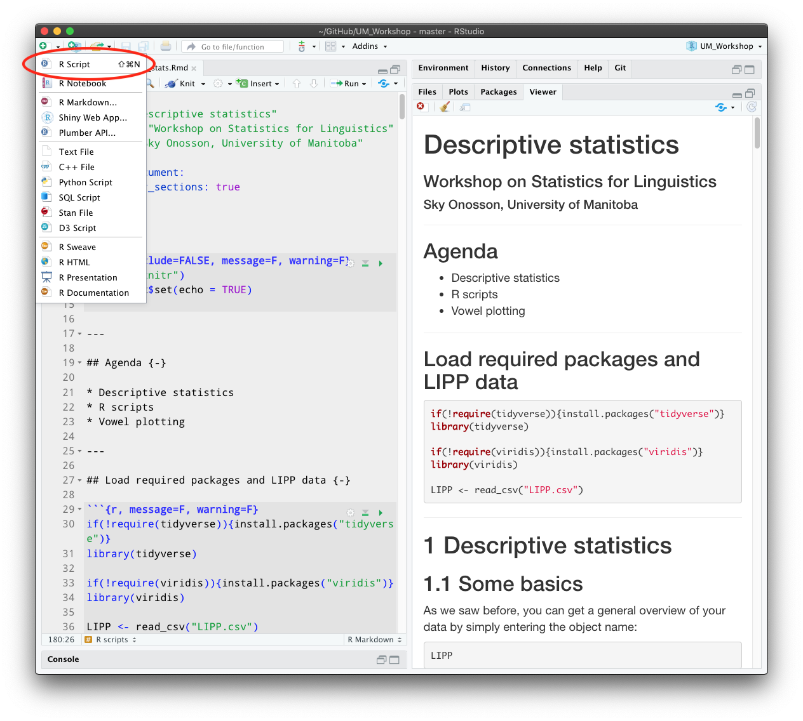

<big>

```{r knitr, include=FALSE, message=F, warning=F}
library("knitr")
opts_chunk$set(echo = TRUE)
```

---

## Agenda {-}

* Descriptive statistics
* R scripts
* Vowel plotting

---

## Load required packages and LIPP data {-}

```{r preliminaries, message=F, warning=F}
if(!require(tidyverse)){install.packages("tidyverse")}
library(tidyverse)

if(!require(viridis)){install.packages("viridis")}
library(viridis)

LIPP <- read_csv("LIPP.csv")
```

---

# Descriptive statistics

## Some basics

As we saw before, you can get a general overview of your data by simply entering the object name:

```{r lipp}
LIPP
```

You can get a summary of major descriptive statistics for all of the columns (variables) in a dataframe using `summary()`:

```{r summary}
summary(LIPP)
```

For variables such as `sex` which are `Class :character`, only one number is reported - Length, which is simply the number of observations (rows). For numeric variables, a set of numbers are reported. Min., Median, Mean, and Max. should be fairly self-explanatory. 1st and 3rd Qu. report "quartiles", which derive from dividing the data distribution into even quarters. The 1st quartile occurs at 25% of the way into the distribution, and the 3rd is at 75% - the median is actually the 2nd quartile, occurring at the centrepoint or 50% of the distribution. All of these numbers can be accessed just for a single variable by specifying it in `summary()`:

```{r f1}
summary(LIPP$F1)
```

The last element shown in the full summary above (which is omitted from the single-item summary) is `NA's` - these are "not available" entries, where a piece of data is missing from the data for some reason.

This is a good opportunity to introduce a couple of useful tidyverse functions. The first is `drop_na()` which is used to eliminate NAs from a dataframe by dropping any row with an NA (in any column). This is useful because NAs can cause problems for data analysis in some cases. Let's use this to create a copy of the LIPP data with all NAs removed:

```{r drop_na}
LIPP_no_NAs <- drop_na(LIPP)
```

Now if we do a summary of the new object, there should be no NA values:

```{r summary_drop_na}
summary(LIPP_no_NAs)
```

The other tidyverse function is called the `pipe` operator, and it looks like this: `%>%`

The easiest way to enter this is with the shortcut `Ctrl+Shift+M` (`Command+Shift+M` also works on MacOS). The pipe takes some bit of R code, usually an object or function, and "pipes" it into some other function. For example, we could rewrite the creation of the `LIPP_no_NAs` object like this:

```{r pipe}
LIPP_no_NAs <- LIPP %>% drop_na()
```

When doing this, the function on the receiving end of the pipe does not have any arguments inside its parentheses - these are piped in from the other side. So in this case, the object `LIPP` is piped into `drop_na()` which operates on it as if it were in the parentheses. The assignment operator still works as usual, so this entire function then gets assigned to `LIPP_no_NAs`.

This may not seem very useful for a single function (and it's really not), but the usefulness of the pipe comes out when you have multiple functions linked together.

For example, let's say you wanted to take the LIPP dataset, drop all NAs, and produce a quickplot of F2. We could do this by creating a copy of the dataset using `drop_na()`, then using that object as the data source for `qplot()`:

```{r qplot}
LIPP_no_NAs <- drop_na(LIPP)
qplot(F2, data = LIPP_no_NAs)
```

However, using the pipe operator, this can all be done in a single line of code which doesn't even require us to create a new object in R. We start with LIPP, pipe it into `drop_na()`, and then pipe that into `qplot()`. 

>**Note:** For some functions like `qplot()` we need to still assign a data source when using the pipe -- to do this, put a period which acts as a placeholder for data coming from the pipe.

```{r qplot_pipe}
LIPP %>% drop_na() %>% qplot(F2, data = .)
```

While not necessary with such a short entry like this, it's often conventional to hit enter after each pipe, as the sections of code between pipes can sometimes be quite lengthy. As an illustration, I'll replace `qplot()` with `ggplot()` and `geom_histogram()`:

```{r code_lines}
LIPP %>% 
  drop_na() %>% 
  ggplot(aes(x = F2)) +
  geom_histogram()
```

>**Note:** The pipe and the + connector following `ggplot()` function in much the same way, so it is somewhat confusing to have to use two different operators here - but the pipe does not work inside a ggplot call, at least at the present time.

Writing the code this way means that we don't need to create a new, separate object in R to handle the "no NA" dataframe. It's very easy to get into the habit of making multiple copies of data as new objects, with slight differences between them such as dropping NAs, removing variables etc. This is not a great habit to get into as it can quickly lead to mistakes when the relationship between different objects isn't clear. This is especially easy to do if you do not have consistent object-naming protocols, but even then it is easy to mix things up. Minimizing the number of objects in the R Environment at any one time is a really good practice to get into.

## Boxplots

One of the most common way to illustrate descriptive statistics for a set of numeric data is with a boxplot, or a box-and-whiskers plot. Let's create a plot for F2 using the pipe operator to send the LIPP dataframe into a ggplot using `geom_boxplot()`. Note that in this case we need to assign the variable, F2, to the y-axis - if you try assigning it to x you will generate an error. 

```{r geom_boxplot}
LIPP %>%
  ggplot(aes(y = F2)) +
  geom_boxplot()
```

Here we have F2 plotted on the y-axis while the x-axis ranges, arbitrarily, from -0.4 to +0.4. This is actually meaningless, but we will later use the x-axis for other purposes.

What does the boxplot show us? The rectangular box itself contains the central 50% range of the distribution, and the central line indicates the median (not the mean!) value, i.e. the value exactly in the centre of the data. The two extended lines or "whiskers" mark the range of the distribution up to 1.5 times the central 50% of the range - any observations beyond these points are considered to be "outliers", which are marked with dots. 

If you recall, a summary of F2 produced a set of "quartile" numbers:

```{r quartile}
summary(LIPP$F2)
```

The 1st quartile marks 25% of the way into the range, and the 3rd quartile marks 75% of the way. In other words, the range sitting between these two indicates the central 50% of the distribution, called the "interquartile range" or IQR, which is the area contained inside the box in the boxplot. By convention, 1.5 * IQR is the length of the whiskers. So, all of the elements making up the boxplot are derived directly from the quantile numbers.

One addition that can be made to a boxplot is to use the x-axis to segregate the data according to another categorical variable, such as vowel.

```{r vowel_boxplot}
LIPP %>%
  ggplot(aes(y = F2, 
             x = vowel)) +
  geom_boxplot()
```

This is useful for comparing F2 values across different vowels. However, as the vowels are simply arranged alphabetically (according to Arpabet naming), it isn't easy to see the general trend in F2 values across vowels. 

What would help would be to rank the vowels in order of F2 values. This can be achieved using the `fct_reorder()` "factor reorder" function. This allows one factor or variable - such as `vowel` to be ordered according to a function performed over some other factor. For a boxplot, median might be the most appropriate function. So, we can reorder `vowel` according to the median F2 value for each vowel:


```{r fct_reorder}
LIPP %>%
  ggplot(aes(y = F2, 
             x = fct_reorder(vowel, F2, .fun = median))) +
  geom_boxplot()
```

Note that the x-axis label now includes the entire function call. If we don't want this, we can replace it using the `xlab()` function:

```{r xlab}
LIPP %>%
  ggplot(aes(y = F2, 
             x = fct_reorder(vowel, F2, .fun = median))) +
  geom_boxplot() +
  xlab("Vowel (arpabet)")
```

>This could also be done with the `labs()` function we saw earlier, but the code would look slightly different -- can you identify the precise difference?

You can order variables using `fct_reorder()` by any function available in R which follows the following criteria:

>It should take one vector for fct_reorder, and two vectors for fct_reorder2, and return a single value.

Similar functions are `fct_relevel()` which lets you specify the levels of a factor in order, `fct_relabel()` which lets you assign labels to factor levels automatically, and `fct_recode()` which lets you manually change the factor levels.

# R scripts

At this point it would be useful to talk about how to write and save code for use with R. The .Rmd files we are using for the workshop are designed to run embedded R code within a document that is otherwise written in Markdown language. In contrast, an R script file is just R code, and is typically what you would use to load data, run tests, create plots, etc.

To start a new R script, click the new file button at the top left of RStudio and select "R Script", or use the shortcut Shift+Command+N (Mac).

```{r new_script, echo = FALSE}

```

Your new script will open in a blank page on line 1. Everything you put into the script should be R code ready to run. The exception is that you can create comments preceded by a `#` - everything on a line after that will be ignored by R.

Here's an example of code you can enter into a script. I've included the code to 

1. load the LIPP datafile into an object
1. generate the boxplot of F2 by vowel ordered by median values, and 
1. save the plot to a file

```{r boxplot_script}
# Load the tidyverse
if(!require(tidyverse)){install.packages("tidyverse")}
library(tidyverse)

# Load data
LIPP <- read_csv("LIPP.csv")

# Create boxplot
LIPP %>%
  ggplot(aes(y = F2, 
             x = fct_reorder(vowel, F2, .fun = median))) +
  geom_boxplot() +
  labs(x = "Vowel (arpabet)")

# Save the plot
ggsave("LIPP_F2_boxplot.pdf")
```

If you save the script (Command+S) to the same folder as the LIPP.csv file, running it in RStudio should work correctly. This is how you would normally work with R code in your own project.

# Vowel plots

The code in this section, and the data to be used, are from Joey Stanley's blog at <http://joeystanley.com>, and in particular his vowel plot tutorial: <http://joeystanley.com/blog/making-vowel-plots-in-r-part-1>. I'm copying his text verbatim with the exception that I am adapting his R code so that it can be run directly inside RStudio.

Some of the descriptions of plot building are repeated from earlier material - we can skip through these as we go.

P.S. The data file which I've included to use in Joey's code is taken from his GitHub page here: <https://github.com/JoeyStanley/joeystanley>. However, when I run the code the plots do not look identical with those on his blog post, which suggests that a somewhat different data file was used originally. Thankfully this doesn't really matter for the purposes of learning how to write and run code.

*Joey's blog post begins here...*

---

# Making vowel plots in R {-}

Last week I was approached by a fellow graduate student who asked how they might go about making vowel plots in R. I’ve made my share of these plots and have learned some tricks along the way, so I thought it might make for an interesting blog post. Actually, I thought it would make for an interesting series of blog posts. In this first one, I’ll stick with scatterplots and look at the code you’ll need for them. In the next one I show how to plot vowel trajectories.

The dataset I’ll be working with comes from me reading 300 sentences while sitting at my kitchen table. This was transcribed manually, force-aligned using DARLA, with formants extracted using FAVE. I’ve removed a lot of the outliers already, so the remaining data is relatively clean.

For this workshop, we’ll need just two packages: dplyr and ggplot2. Let’s load those now.

```{r packages}
library(dplyr)
library(ggplot2)
```

>**Note from Sky:** Actually these packages are both loaded in `tidyverse`, so could both replaced with just: `library(tidyverse)`

Just FYI, there are actually some phonetic-specific packages that make it easier to do this (I’m thinking the vowels package by Tyler Kendall and Erik Thomas), but I like the flexibility of doing it from scratch in ggplot2.

## Read in and process data

As with any R script, the first step (after loading your packages) is to read in and prepare your data. For maximal reproducibility in your own data, I’m going to work with the FAVE output as is, so you can see how I process the data. This means that we’ll be seeing the vowels in “ARPABET”, rather than IPA. Since the focus of this post isn’t necessarily on the minutia of the data processing, I’ll keep that part to a minimum.

```{r my_vowels}
my_vowels <- read.csv("data/joey.csv") %>%
    filter(stress == 1, 
           !vowel %in% c("AY", "AW", "OY", "ER"),
           !word %in% c("TO", "US", "ON")) %>%
    mutate(word = tolower(word))
```

So what this chunk does is it reads in file called joey.csv that I have saved in a folder called data. It then filters the data by keeping just the vowels with primary stress, removing diphthongs and /ɚ/, and removing a couple stop words. Then it changes all the words so that they’re lowercase.

## Building a basic scatterplot

The way things work in ggplot2 is we be build a visualization layer by layer. The base layer can be created by just using the ggplot() function.

```{r base}
ggplot()
```

It’s just a blank, gray rectangle, but it is valid code. To make this actually useful, we can tell it to work with the my_vowels data.

```{r data}
ggplot(my_vowels)
```

Okay still no visualization, but we’re on our way. The next part of a ggplot function is what’s called the mapping argument. This is where you tell ggplot which columns of your data should correspond to what parts of the visualization. Traditionally in vowel plots, we want F2 along the x-axis and F1 along the y-axis. We can do that using the aes() function and specify that we want to work with the columns called F1 and F2 from our spreadsheet.

```{r aes}
ggplot(my_vowels, aes(x = F2, y = F1))
```

We’re getting closer. What ggplot has done at this point is added some information to your plot already. There are now x- and y-axis labels, ticks, and a grid with major and minor lines. All we need to do is populate this with some data.

### Tangent: Column names

See Labov, Rosenfelder, & Fruehwald's 2013 article in Language here for details on these columns.

Side note. In FAVE output, there are several column names with formant data. The F1 and F2 columns have measurements at slightly different points depending on the vowel. If you want to plot the midpoints specifically, you’ll have to use different column names. If you open the file in Excel, the column names are F1@50% and F2@50%. However, R doesn’t really like having the @ or % in the column names, so if you read it in using read.csv like I did, those characters will be changed to periods, meaning the column names are actually F1.50. and F2.50.. So if you want to use midpoints, be sure to do use those columns instead:

```{r columns}
ggplot(my_vowels, aes(x = F2.50., y = F1.50.))
```

Side-side note. If you read your data in using read_csv (with an underscore) from the readr package (which is part of the “tidyverse”), it actually handles the real name of the column. However, you’ll have to put little ticks (that apostrophe-looking thing next to your “1” key) around them:

```
#my_vowels_readr <- readr::read_csv("data/joey.csv")
#ggplot(my_vowels_readr, aes(x = `F2@50%`, y = `F1@50%`))
```

We’ll stick with the basic F1 and F2 columns, but I thought you might find it handy to know what the different columns in your FAVE output mean.

## Anyway, back to the scatterplot

All we need to do at this point is to add the scatterplot. We can do that by adding a separate layer to the ggplot function. To do this, just add a plus sign (+) at the end of the line, start a new line, and add the function geom_point, which is the function for making a scatterplot in ggplot2.

```{r geom_point}
ggplot(my_vowels, aes(x = F2, y = F1)) + 
    geom_point()
```

Aha! We now have a scatterplot! It’s not the most useful one because we can’t tell what vowel or word each point came from. But it is a start.

## Themes

You can explore the other themes by typing the command ?theme_classic and looking at the other options.
Right now, you might be wondering why we have a gray background. This is on purpose by the designers of ggplot2 because it makes colors pop out. You can change the overall look and feel of your plot using various theme functions. I like theme_bw(), theme_classic(), and theme_minimal() myself, so I’ll stick with theme_classic() for today.

```{r themes}
ggplot(my_vowels, aes(x = F2, y = F1)) + 
    geom_point() + 
    theme_classic()
```

## Coloring vowels

Because English has so many vowels, there’s no really good way to show them all on a plot. Typically, I use color, but it’s hard to get a set of 11 colors that are all easily distinguishable and easy on the eyes. There’s no real way to win here. For now, let’s just add the default colors and see how it looks.

So how do we add color? If you think about it, what we want ggplot to do is to change the color of the dot depending on what the vowel is. Since the vowel is stored in a column called vowel in our spreadsheet, in a practical sense we want to tell ggplot to simply change the color of the dot so that each value in the vowel column has its own color.

```{r colour}
ggplot(my_vowels, aes(x = F2, y = F1, color = vowel)) + 
    geom_point() + 
    theme_classic()
```

Okay, so let’s look at the result. The most obvious thing we see is that there is now color, but there’s also a legend too. Each unique vowel in our data is now represented in this legend, and the name of the column in our spreadsheet, vowel, is the title of that legend. One subtler change is that the plotting area is actually a little bit narrower to make room for the legend.

How is this color assigned? First, it puts all the vowels in alphabetical order. But keep in mind that this is based on the ARPABET notation, which might not be the order you want. In IPA, it ends up being /ɑ, æ, ʌ, ɔ, ɛ, e, ɪ, i, o, ʊ, u/. It then takes that order and, going around the color wheel from red to pink, picks 11 equidistant, maximally-distinct colors. Because of the nature of how color works, there are several shades of blue and green, but not very many warm colors. We’ll see how to fix the order of these colors, as well as the specific color values, in just a sec.

### Tangent: reversing the axes

Now wait a second. The high front vowel /i/—represented by the digraph “IY”—is in the bottom right of the plot when it traditionally is in the top left. Vowel plots typically reverse both the x- and the y-axes so that high vowels are at the top, and front vowels are on the right. This is just convention but it has to do with the inverse relationship with the actual formant values and our perception of sounds. Anyway, the functions you’re looking for are scale_x_reverse() and scale_y_reverse(), which should each be added as their own layer. (Unlike most other layers, I typically put these on one line.)

```{r reverse}
ggplot(my_vowels, aes(x = F2, y = F1, color = vowel)) + 
    geom_point() + 
    scale_x_reverse() + scale_y_reverse() + 
    theme_classic()
```

Okay, much better. Now we can see that the bright blue IY vowel is in the top left, the pink UW is in the top right-ish, and my unmerged AA and AO (/ɑ/ and /ɔ/, as in cot and caught) are in the bottom right.

###Changing the order

If you want to change the order of the colors and the order in the legend, there are two ways to do that. The first is by leaving your underlying data alone and making superficial changes only within ggplot itself. This is a useful thing to know how to do, but I won’t cover that here. If you’re interested, I’d highly recommend this page on that, or you can peruse one of the ggplot2 workshops I did.

At least for the order of the vowels, what I think is the most useful option is to actually modify your dataset and then plot the modified version. The way to do this to overwrite the vowel column in our my_vowels dataset, and, using the factor function, manually specifying the order you want them to be in. The actual data itself doens’t change, but what we’re doing is modifying how R treats this column under the hood. This is the order that I typically do, but you’re of course free to do whatever you want.

````{r factor}
my_vowels$vowel <- factor(my_vowels$vowel, 
                          levels = c("IY", "IH", "EY", "EH", "AE", 
                                     "AA", "AO", "OW", "UH", "UW", "AH"))
ggplot(my_vowels, aes(x = F2, y = F1, color = vowel)) + 
    geom_point() + 
    scale_x_reverse() + scale_y_reverse() + 
    theme_classic()
```

The benefit to this is that now the vowels are in a somewhat logical order in the legend. The downside is that the colors of each vowel are very close to other vowels near them in the vowel space. What would be better is to have vowels near each other to be different visually.

Just for funsies, I tried a different order essentially by just choosing every third vowel.

```{r third}
my_vowels$vowel <- factor(my_vowels$vowel, 
                          levels = c("IY", "EH", "AO", "UH", "IH", 
                                     "AE", "AH", "UW", "EY", "AA", "OW"))
ggplot(my_vowels, aes(x = F2, y = F1, color = vowel)) + 
    geom_point() + 
    scale_x_reverse() + scale_y_reverse() + 
    theme_classic()
```

This is the first time I’ve done this and I kinda like it. I’ll stick with it. The good part is that the vowels are for the most part relatively easy to distinguish from their neighbors. The major downside is that the legend is the exact order I specified, which is useless for finding something. What we need to do is actually modify the legend order. We can do that with the scale_color_discrete function added to our growing stack of ggplot code and then supply the order you want it to be in as the breaks argument.

```{r breaks}
ggplot(my_vowels, aes(x = F2, y = F1, color = vowel)) + 
    geom_point() + 
    scale_x_reverse() + scale_y_reverse() + 
    scale_color_discrete(breaks = c("IY", "IH", "EY", "EH", "AE", 
                                    "AA", "AO", "OW", "UH", "UW", "AH")) + 
    theme_classic()
```

Great. Now the colors are distinct from one another and the order of the legend is back to an order we might expect.

## Adding vowel means
The problem with the plot the way it is, is you still have to constantly check back and forth between the legend and the plot to see what vowel you’re looking at. An easier solution would be to plot the name of the vowel itself inside of its cluster.

One solution that I think I’ve seen before is to use the stat_summary function. Supposedly this works, and if you know how to use it, by all means go for it. I’ve never gotten it to work and I found a workaround that I like that I think offers more flexibility anyway. It involves creating a separate dataset and essentially overlaying a second scatterplot over the main one.

To create this, I pull out some black magic from the dplyr package. First, I start with the my_vowels dataset. I then “pipe” it (the %>% function) to the summarise function. This function makes it easy to get summary statistics from your data. We’re creating a new, arbitrarily-named column called mean_F1, which is calculated as the mean of the values in the F1 column. Same thing for mean_F2. However, as it is, we’ll end up with two numbers: the average F1 and F2 of all your data, which would probably be somewhere near the middle of your vowel space.

```{r means}
means <- my_vowels %>%
    summarise(mean_F1 = mean(F1),
              mean_F2 = mean(F2)) %>%
    print()
```

What we actually want is the mean F1 and F2 per vowel. So, what we do is insert the group_by function just before summarise. By itself, group_by doesn’t really do much except change some stuff about the dataframe under the hood. But these changes are especially useful when that is then “piped” (%>%) to summarise. Because I did group_by(vowel) first, whatever summary information you want from your dataset will apply to each vowel independently. So, instead of the average overall, you’re getting the average per group. The result is a new dataframe that we’re calling means, that has all the information we want. (I’m then piping it to a print function so we can see the output.)

```{r group_by}
means <- my_vowels %>%
    group_by(vowel) %>%
    summarise(mean_F1 = mean(F1),
              mean_F2 = mean(F2)) %>%
    print(n = 11)
```

This new dataset, means, is a perfectly good, stand-alone dataset that we can plot by itself. Note that because we called the columns mean_F1 and mean_F2, we’ll have to use those in the ggplot2 function.

```{r means_plot}
ggplot(means, aes(x = mean_F2, y = mean_F1)) + 
    geom_point() + 
    theme_classic()
```

The points themselves aren’t very enlightening. To add some pizzazz, I’m going to use geom_label. This is essentially the same thing at geom_point because it makes a scatterplot, but instead of dots it’ll print these nice little labels. Of course, you have to tell ggplot what text to use for these labels, so we’ll tell it to use the text in the vowel column in the means dataset.

```{r geom_label}
ggplot(means, aes(x = mean_F2, y = mean_F1, label = vowel)) + 
    geom_label() + 
    theme_classic()
```

Ooh! Okay, so now we’re geting somewhere. Here it becomes obvious that we need to reverse the x- and y-axes. Let’s do that too.

```{r reverse2}
ggplot(means, aes(x = mean_F2, y = mean_F1, label = vowel)) + 
    geom_label() + 
    scale_x_reverse() + scale_y_reverse() + 
    theme_classic()
```

Perfect. So we’ve seen how to plot the points themselves, and now we’ve seen how to plot the means. Now comes the fun part of actually overlaying them into one plot.

It’s perfectly possible to plot two (or more) different datasets in a single visualization, but you’ll have to be careful about the aes() functions. Anything in the ggplot(aes()) function will apply to all other layers, unless they’re overridden. That’s why we didn’t need to provide any additional information in geom_point because it inherited all its information (the data, the axes, the color) from ggplot.

If we want to add the means, we’re using a different dataset, so that right off that bat has to be overridden in our geom_label function:

    # Don't plot this yet...
    ...
    geom_label(data = means) + 
    ...
Because we’re using geom_label, we’re going to need to put label = vowel somewhere. You can put it in the main ggplot(aes()) function with everything else and that’ll work out fine:

    # Don't plot this yet...
    ggplot(my_vowels, aes(x = F2, y = F1, color = vowel, label = vowel)) + 
    ...
    geom_label(data = means) + 
    ...
    
However, we’re going to have to supply our own aes() function within geom_label. The reason for that is because right now we’ve got x = F2 and y = F1 as global settings. Our new means dataframe doesn’t have columns with those names. So we’ll have to override these by adding a second aes() function, this time within geom_label:

    # Still don't run this.
    ggplot(my_vowels, aes(x = F2, y = F1, color = vowel, label = vowel)) + 
    ...
    geom_label(data = means, aes(x = mean_F2, y = mean_F1)) + 

Add all the other pieces to the plot, and let’er rip.

```{r points_labels}
ggplot(my_vowels, aes(x = F2, y = F1, color = vowel, label = vowel)) + 
    geom_point() + 
    geom_label(data = means, aes(x = mean_F2, y = mean_F1)) + 
    scale_x_reverse() + scale_y_reverse() + 
    scale_color_discrete(breaks = c("IY", "IH", "EY", "EH", "AE", 
                                     "AA", "AO", "OW", "UH", "UW", "AH"))  + 
    theme_classic()
```

Aha! So now we have a vowel plot that has the points, and on top of them it has the labels for these vowels right where the averages are. Pretty cool.

A couple things to note here. In the legend, notice that the dots have now all turned into little a’s. This is because we’re using geom_label now. I don’t know how to change this. I kinda wish they would go back to dots, but I don’t know how to fix that. We can actually remove the legend entirely with guides(color = FALSE) because now it’s not providing any additional clarity.

```{r guides}
ggplot(my_vowels, aes(x = F2, y = F1, color = vowel, label = vowel)) + 
    geom_point() + 
    geom_label(data = means, aes(x = mean_F2, y = mean_F1)) + 
    scale_x_reverse() + scale_y_reverse() + 
    scale_color_discrete(breaks = c("IY", "IH", "EY", "EH", "AE", 
                                     "AA", "AO", "OW", "UH", "UW", "AH")) +
    guides(color = FALSE) + 
    theme_classic()
```

Another thing to notice is that the labels are automatically colored the same as the vowels! How did it do that? We’ll, as it turns out, geom_label inherited the color = vowel argument from the main ggplot(aes()) function. It worked because it just so happens that the column vowel exists in both the means and the my_vowels datasets. Pretty cool. If you want to override it, perhaps by making them all black, you can certainly do so. Just put it within geom_label but not inside of aes:

```{r black}
ggplot(my_vowels, aes(x = F2, y = F1, color = vowel, label = vowel)) + 
    geom_point() + 
    geom_label(data = means, aes(x = mean_F2, y = mean_F1), color = "black") + 
    scale_x_reverse() + scale_y_reverse() + 
    scale_color_discrete(breaks = c("IY", "IH", "EY", "EH", "AE", 
                                     "AA", "AO", "OW", "UH", "UW", "AH")) +
    guides(color = FALSE) + 
    theme_classic()
```

If course, now it’s not quite as clear which cluster the labels belong to. It’s up to you.

### Tangent: An alternative approach
Side note, we could have saved ourselves some headache by planning ahead. When we created the means dataframe, we could have called the new columns F1 and F2 to match the columns in my_vowels. By doing that, we wouldn’t need to override the x and y arguments. All of that code would look like this.

```{r alternative}
means <- my_vowels %>%
    group_by(vowel) %>%
    summarise(F1 = mean(F1),
              F2 = mean(F2))
ggplot(my_vowels, aes(x = F2, y = F1, color = vowel, label = vowel)) + 
    geom_point() + 
    geom_label(data = means) + 
    scale_x_reverse() + scale_y_reverse() + 
    scale_color_discrete(breaks = c("IY", "IH", "EY", "EH", "AE", 
                                     "AA", "AO", "OW", "UH", "UW", "AH")) + 
    guides(color = FALSE) + 
    theme_classic()
```

## Ellipses

One final thing that would be good to show in a vowel plot are ellipses. These are often used to get an idea of the distribution of the vowels or to show degree of overlap. Fortunately, they’re pretty easy to implement (a lot easier than means at least). The main function that takes care of these is stat_ellipse.

```{r stat_ellipse}
ggplot(my_vowels, aes(x = F2, y = F1, color = vowel, label = vowel)) + 
    geom_point() + 
    geom_label(data = means, aes(x = F2, y = F1), color = "black") + 
    stat_ellipse() + 
    scale_x_reverse() + scale_y_reverse() + 
    scale_color_discrete(breaks = c("IY", "IH", "EY", "EH", "AE", 
                                     "AA", "AO", "OW", "UH", "UW", "AH")) +
    guides(color = FALSE) + 
    theme_classic()
```

Easy-peasy. By default, these ellipses cover about a 95% confidence interval (or approximately two standard deviations) around the means of each vowel. We can change that to whatever we want using the level function. I usually set mine to 0.67, which corresponds to about one standard deviation. This only changes the size of the ellipses, leaving shape/orientation the same.

```{r standard_deviation}
ggplot(my_vowels, aes(x = F2, y = F1, color = vowel, label = vowel)) + 
    geom_point() + 
    geom_label(data = means, aes(x = F2, y = F1), color = "black") + 
    stat_ellipse(level = 0.67) + 
    scale_x_reverse() + scale_y_reverse() + 
    scale_color_discrete(breaks = c("IY", "IH", "EY", "EH", "AE", 
                                     "AA", "AO", "OW", "UH", "UW", "AH")) +
    guides(color = FALSE) + 
    theme_classic()
```

### Tangent: Ordering

You might be wondering why I order the layers in the block of code the way I do. For the most part, the order doesn’t matter, but for some things it does. So if you look carefully at the above plot, you’ll see that the ellipses lines actually cover the labels. The reason for that is simply because the stat_ellipse function came after geom_label. I think it looks better with the labels on top, so you can switch those.

```{r code_order}
ggplot(my_vowels, aes(x = F2, y = F1, color = vowel, label = vowel)) + 
    geom_point() + 
    stat_ellipse(level = 0.67) + 
    geom_label(data = means, aes(x = F2, y = F1), color = "black") + 
    scale_x_reverse() + scale_y_reverse() + 
    scale_color_discrete(breaks = c("IY", "IH", "EY", "EH", "AE", 
                                     "AA", "AO", "OW", "UH", "UW", "AH")) +
    guides(color = FALSE) + 
    theme_classic()
```

As far as I can tell, many of the other things like scale_x_reverse, scale_y_reverse, and scale_color_discrete can go anywhere. Generally, I order my block with the important things first (like geom_point since this is a scatterplot after all), then the small cosmetic changes (like scale_x_reverse), and then any themes.

### Making the ellipses the focus

Sometimes, you just have too much data and you lose the forest for the trees with all those points. You can easy remove them and leave just the means and the ellipses by removing (or just commenting out) the geom_point line.

```{r no_points}
ggplot(my_vowels, aes(x = F2, y = F1, color = vowel, label = vowel)) + 
    #geom_point() + 
    stat_ellipse(level = 0.67) + 
    geom_label(data = means, aes(x = F2, y = F1)) + 
    scale_x_reverse() + scale_y_reverse() + 
    scale_color_discrete(breaks = c("IY", "IH", "EY", "EH", "AE", 
                                     "AA", "AO", "OW", "UH", "UW", "AH")) +
    guides(color = FALSE) + 
    theme_classic()
```

That’s one way to clean it up. We could also keep them but make them a bit transparent by adding the alpha argument. The range of values for alpha is from 0 to 1, with 1 being completely opaque and 0 being invisible. An alpha level of 0.2 means that it takes 5 (0.2 = 1/5) overlapping points to become completely opaque. In other words it’s only shaded in 20%.

```{r alpha_points}
ggplot(my_vowels, aes(x = F2, y = F1, color = vowel, label = vowel)) + 
    geom_point(alpha = 0.2) + 
    stat_ellipse(level = 0.67) + 
    geom_label(data = means, aes(x = F2, y = F1)) + 
    scale_x_reverse() + scale_y_reverse() + 
    scale_color_discrete(breaks = c("IY", "IH", "EY", "EH", "AE", 
                                     "AA", "AO", "OW", "UH", "UW", "AH")) +
    guides(color = FALSE) + 
    theme_classic()
```

We could also change the size so that they’re smaller. I’ve found that the exact size depends on how much data you’re displaying, but if you make it smaller than the default of 1.5, you might have a slightly cleaner plot. I’ll make mine about half the default size by adding size = 0.75 within geom_point.

```{r size}
ggplot(my_vowels, aes(x = F2, y = F1, color = vowel, label = vowel)) + 
    geom_point(size = 0.75) + 
    stat_ellipse(level = 0.67) + 
    geom_label(data = means, aes(x = F2, y = F1)) + 
    scale_x_reverse() + scale_y_reverse() + 
    scale_color_discrete(breaks = c("IY", "IH", "EY", "EH", "AE", 
                                     "AA", "AO", "OW", "UH", "UW", "AH")) +
    guides(color = FALSE) + 
    theme_classic()
```

You could even change the size to a lot smaller, like 0.1 or even 0.01. You could also keep them relatively large but change the transparency as well (size = 2, alpha = 0.5). The sky’s the limit!

```{r size_alpha}
ggplot(my_vowels, aes(x = F2, y = F1, color = vowel, label = vowel)) + 
    geom_point(size = 1, alpha = 0.5) + 
    stat_ellipse(level = 0.67) + 
    geom_label(data = means, aes(x = F2, y = F1)) + 
    scale_x_reverse() + scale_y_reverse() + 
    scale_color_discrete(breaks = c("IY", "IH", "EY", "EH", "AE", 
                                     "AA", "AO", "OW", "UH", "UW", "AH")) +
    guides(color = FALSE) + 
    theme_classic()
```

### Shaded ellipses

I want to touch on how to shade the ellipses in. This takes slightly more finagling within stat_ellipse, but the result is pretty cool.

The main argument that you need to add is geom = "polygon" within stat_ellipse. Try that and see what the result is:

```{r polygon}
ggplot(my_vowels, aes(x = F2, y = F1, color = vowel, label = vowel)) + 
    stat_ellipse(level = 0.67, geom = "polygon") + 
   geom_label(data = means, aes(x = F2, y = F1)) +  
    scale_x_reverse() + scale_y_reverse() + 
    scale_color_discrete(breaks = c("IY", "IH", "EY", "EH", "AE", 
                                     "AA", "AO", "OW", "UH", "UW", "AH")) +
    guides(color = FALSE) + 
    theme_classic()
```

Okay, so that has the effect of filling them all in black. That’s probably not what we had in mind. Let’s make them all a bit transparent by adding the alpha = 0.2 argument as a part of stat_ellipse.

```{r alpha_polygon}
ggplot(my_vowels, aes(x = F2, y = F1, color = vowel, label = vowel)) + 
    stat_ellipse(level = 0.67, geom = "polygon", alpha = 0.1) + 
   geom_label(data = means, aes(x = F2, y = F1)) + 
    scale_x_reverse() + scale_y_reverse() + 
    scale_color_discrete(breaks = c("IY", "IH", "EY", "EH", "AE", 
                                     "AA", "AO", "OW", "UH", "UW", "AH")) +
    guides(color = FALSE) + 
    theme_classic()
```

Finally, we can actually color these ellipses based on the vowels themselves by adding fill = vowel to our aes function:

```{r colour_polygon}
ggplot(my_vowels, aes(x = F2, y = F1, color = vowel, label = vowel, fill = vowel)) +
  stat_ellipse(level = 0.67, geom = "polygon", alpha = 0.1) +
  geom_label(data = means, aes(x = F2, y = F1)) +
  scale_x_reverse() + scale_y_reverse() +
  scale_color_discrete(breaks = c("IY", "IH", "EY", "EH", "AE", 
                                     "AA", "AO", "OW", "UH", "UW", "AH")) +
  guides(color = FALSE) + 
  theme_classic()
```

Whoops! What did that do? Yes, the ellipses are shaded in correctly, but now the labels are too! Turns out, in geom_label, the fill argument also modifies the background color, which is normally white. We could either override the fill on geom_label and set it to "white", or, better yet, let’s just add aes(fill = vowel) just to stat_ellipse to prevent any other potential bugs.

```{r fill_ellipse}
ggplot(my_vowels, aes(x = F2, y = F1, color = vowel, label = vowel)) + 
  stat_ellipse(level = 0.67, geom = "polygon", alpha = 0.1, aes(fill = vowel)) + 
  geom_label(data = means, aes(x = F2, y = F1)) + 
  scale_x_reverse() + scale_y_reverse() + 
  scale_color_discrete(breaks = c("IY", "IH", "EY", "EH", "AE", 
                                     "AA", "AO", "OW", "UH", "UW", "AH")) +
  guides(color = FALSE) + 
  theme_classic()
```

Aha. Now we get the desired result. Note though that our legend is back. This is because we told ggplot2 to not display a legend as it relates to color using guides(color = FALSE), but we didn’t say anything about this new fill aesthetic. We can just add fill = FALSE there and it’ll take it out.

```{r no_legend}
ggplot(my_vowels, aes(x = F2, y = F1, color = vowel, label = vowel)) + 
  stat_ellipse(level = 0.67, geom = "polygon", alpha = 0.1, aes(fill = vowel)) + 
  geom_label(data = means, aes(x = F2, y = F1)) +
  scale_x_reverse() + scale_y_reverse() + 
  scale_color_discrete(breaks = c("IY", "IH", "EY", "EH", "AE", 
                                     "AA", "AO", "OW", "UH", "UW", "AH")) +
  guides(color = FALSE, fill = FALSE) + 
  theme_classic()
```

Really though, the guides option is only good if you want to remove specific aspects of the legend but not all of it. Alternatively, we can just use theme(legend.position="none") instead and that’ll remove the legend no matter what else we add to the plot. However, this has to come after any themes you might apply to the plot.

```{r legend.position}
ggplot(my_vowels, aes(x = F2, y = F1, color = vowel, label = vowel)) + 
    stat_ellipse(level = 0.67, geom = "polygon", alpha = 0.1, aes(fill = vowel)) + 
    geom_label(data = means, aes(x = F2, y = F1)) +  
    scale_x_reverse() + scale_y_reverse() + 
    scale_color_discrete(breaks = c("IY", "IH", "EY", "EH", "AE", 
                                     "AA", "AO", "OW", "UH", "UW", "AH")) +
    theme_classic() + 
    theme(legend.position="none")
```

So shaded ellipses are cool, but because we have so many vowels in English they can get a little muddy. If you’re only working with a subset of English vowels or a language with fewer vowels, it’ll look a little crisper, even if you add the points back in. I’ll just take five vowels and plot them, and I’ll even add shape in there too for fun. (Can you see how I did that?)

```{r my_five_vowels}
my_five_vowels <- subset(my_vowels, vowel %in% c("IY", "EH", "AA", "OW", "UW"))
five_means <- my_five_vowels %>%
    group_by(vowel) %>%
    summarise(mean_F1 = mean(F1),
              mean_F2 = mean(F2))
ggplot(my_five_vowels, aes(x = F2, y = F1, color = vowel, label = vowel, shape = vowel)) + 
    geom_point() + 
    stat_ellipse(level = 0.67, geom = "polygon", alpha = 0.1, aes(fill = vowel)) + 
    geom_label(data = five_means, aes(x = mean_F2, y = mean_F1)) + 
    scale_x_reverse() + scale_y_reverse() + 
    scale_color_discrete(breaks = c("IY", "IH", "EY", "EH", "AE", 
                                     "AA", "AO", "OW", "UH", "UW", "AH")) +
    theme_classic() + 
    theme(legend.position="none")
```

## Text instead of points

Okay, last thing, I promise. If your dataset is relatively small, a really slick trick is to plot the words themselves rather than points. We saw how to do this above when we were plotting the means, but let’s apply that to the regular data. For this example, I’ll just zoom in on my “AA” and “AO” vowels (except for the ones before /ɹ/) because I’ve been reading about the cot-caught merger recently.

```{r cot_caught}
cot_caught <- subset(my_vowels, vowel %in% c("AA", "AO") & fol_seg != "R")
cot_caught_means <- cot_caught %>%
    group_by(vowel) %>%
    summarise(mean_F1 = mean(F1),
              mean_F2 = mean(F2))
```

So here’s what this would look like with points.

```{r merger}
ggplot(cot_caught, aes(x = F2, y = F1, color = vowel, label = vowel, shape = vowel)) + 
    geom_point() + 
    stat_ellipse(level = 0.67, geom = "polygon", alpha = 0.1, aes(fill = vowel)) + 
    geom_label(data = cot_caught_means, aes(x = mean_F2, y = mean_F1)) + 
    scale_x_reverse() + scale_y_reverse() + 
    scale_color_discrete(breaks = c("IY", "IH", "EY", "EH", "AE", 
                                     "AA", "AO", "OW", "UH", "UW", "AH")) +
    theme_classic() + 
    theme(legend.position="none")
```

The trick here is to use geom_text instead of geom_point. Note that geom_text is very similar to geom_label, which is what we used for the means. The only difference I’ve been able to see is that there’s a nice little box around geom_label and not one for geom_text.

```{r geom_text}
ggplot(cot_caught, aes(x = F2, y = F1, color = vowel, label = vowel, shape = vowel)) + 
    geom_text() + 
    stat_ellipse(level = 0.67, geom = "polygon", alpha = 0.1, aes(fill = vowel)) + 
    geom_label(data = cot_caught_means, aes(x = mean_F2, y = mean_F1)) + 
    scale_x_reverse() + scale_y_reverse() + 
    scale_color_discrete(breaks = c("IY", "IH", "EY", "EH", "AE", 
                                     "AA", "AO", "OW", "UH", "UW", "AH")) +
    theme_classic() + 
    theme(legend.position="none")
```

Oops! That’s not what we wanted! For the means, yes, we want the vowel. But for the points we want the actual word. This means we have to add label = word to our code somewhere. For clarity, I’ll move label = vowel out of ggplot(aes() and into geom_label(aes()). That way there is no default label and every time we call geom_text or geom_label we need to specify label individually. (Also, I’ll get rid of shape = vowel since that’s not being used anymore.)

```{r words}
ggplot(cot_caught, aes(x = F2, y = F1, color = vowel)) + 
    geom_text(aes(label = word)) + 
    stat_ellipse(level = 0.67, geom = "polygon", alpha = 0.1, aes(fill = vowel)) + 
    geom_label(data = cot_caught_means, aes(x = mean_F2, y = mean_F1, label = vowel)) + 
    scale_x_reverse() + scale_y_reverse() + 
    scale_color_discrete(breaks = c("IY", "IH", "EY", "EH", "AE", 
                                     "AA", "AO", "OW", "UH", "UW", "AH")) +
    theme_classic() + 
    theme(legend.position="none")
```

Aha! There we go. So this is a way to make a plot look cooler. Especially if individual lexical items are part of your analysis and particularly if you don’t have a lot of data to show at once. If you want, try it with the full dataset just to see how not helpful it is, but be aware that it can be slow to render if you have a lot of data to show.

## Final remarks
The way you present your data is all up to you. I often prefer a set of settings when I’m playing around with my data, but then switch to a different set when I want to copy and paste into a presentation or paper. It’s good to be comfortable enough with ggplot2 so that you know what is going on and what changes you can make. Hopefully this post made a few things clearer.

If you’re interested in plotting trajectories, feel free to look at Part 2 of this tutorial. In the future, I’d like make some other posts on some slightly more advanced topics in vowel plots. I hope this one at least has helped you and your research.

</big>