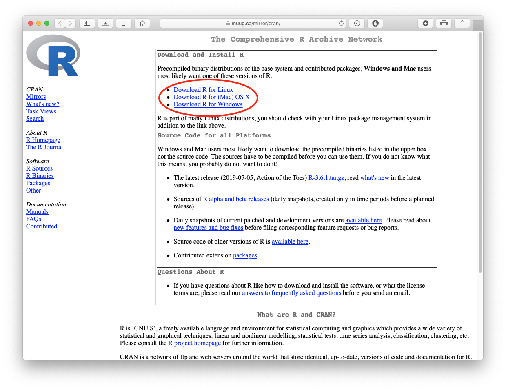
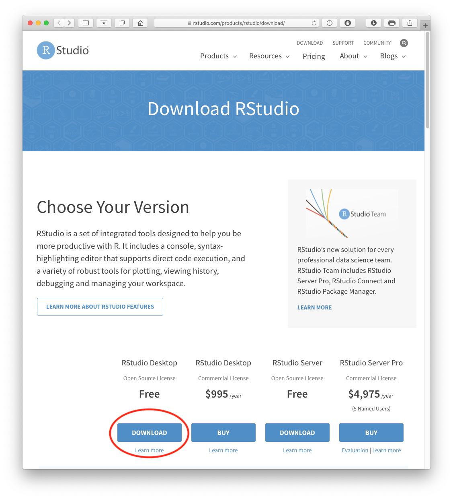
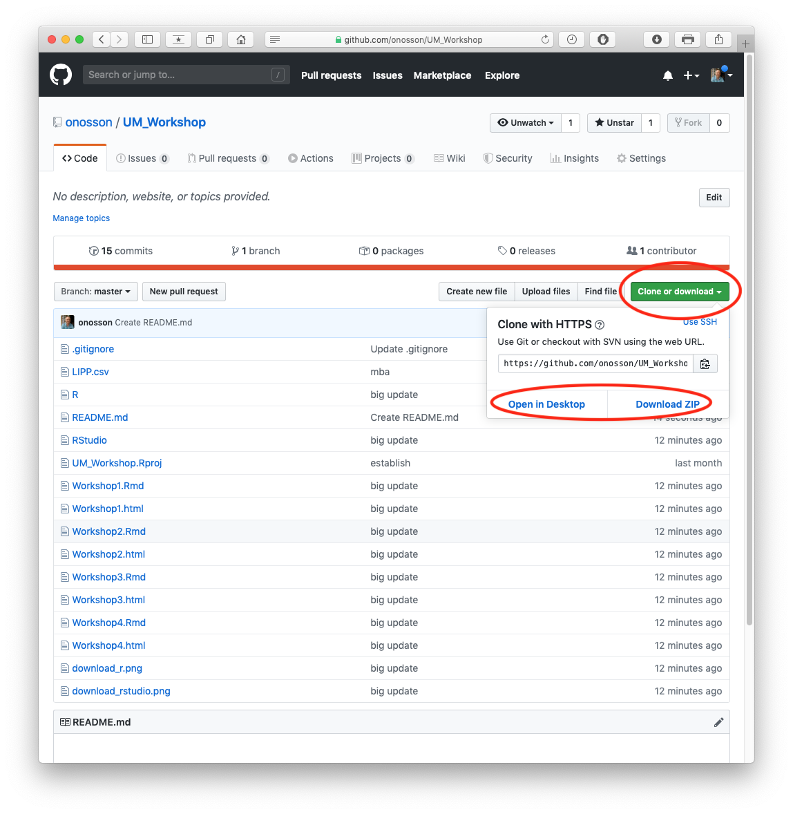
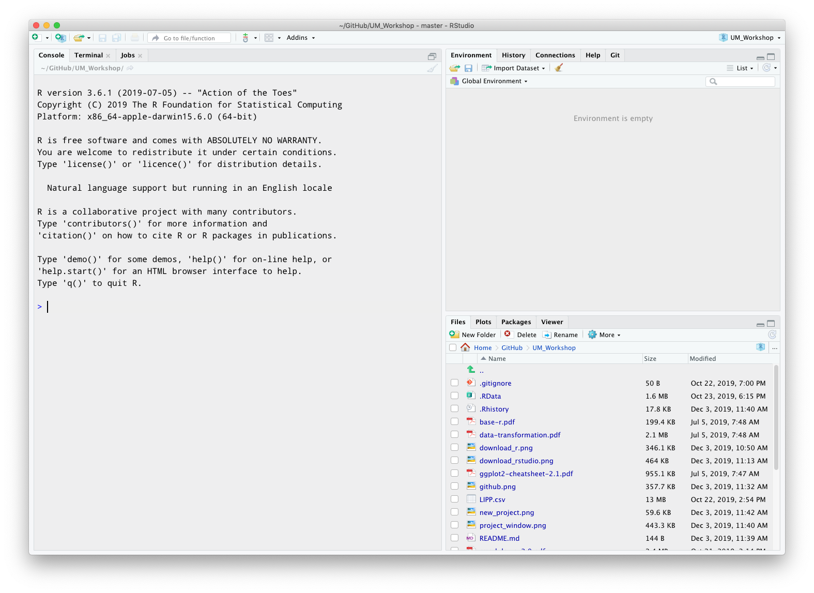
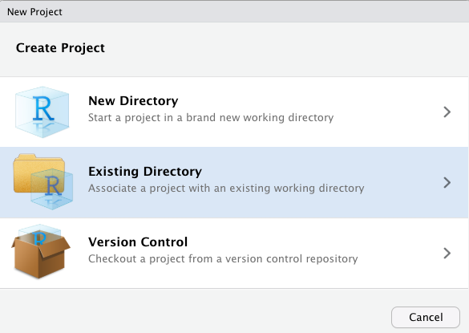
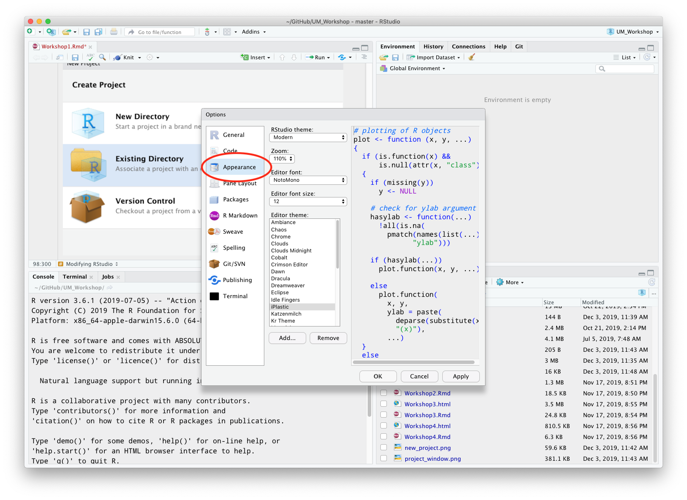
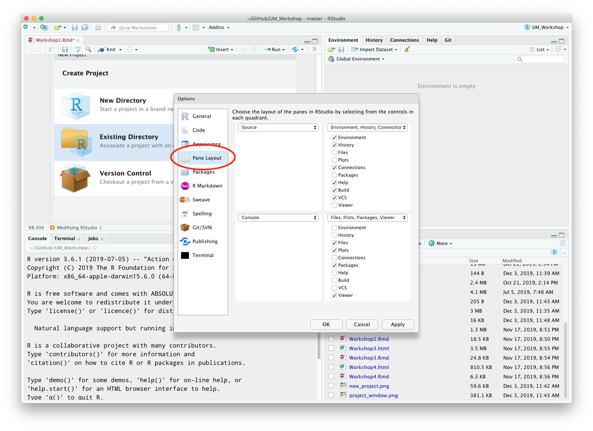
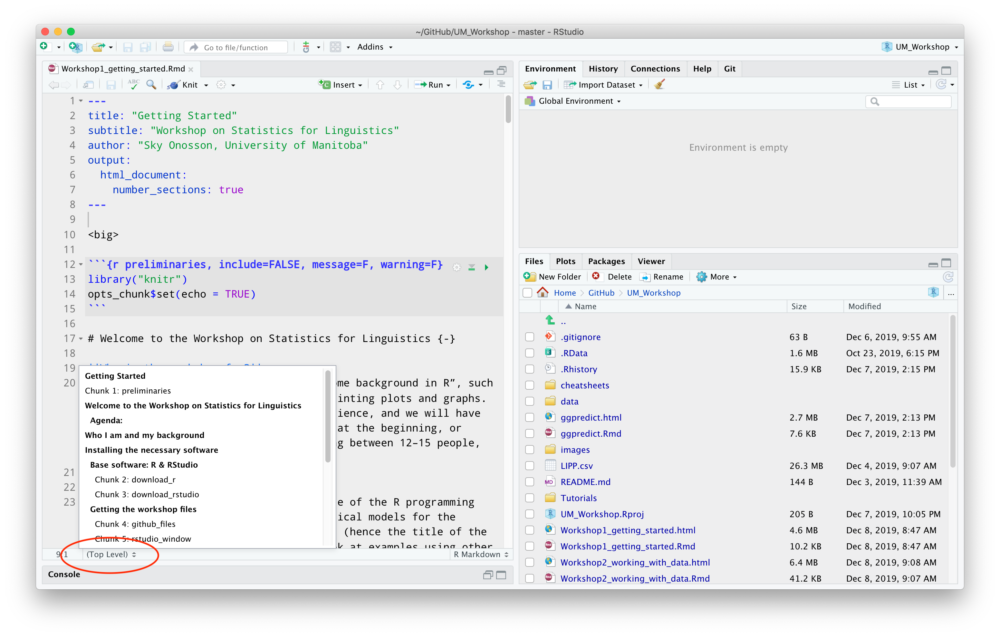
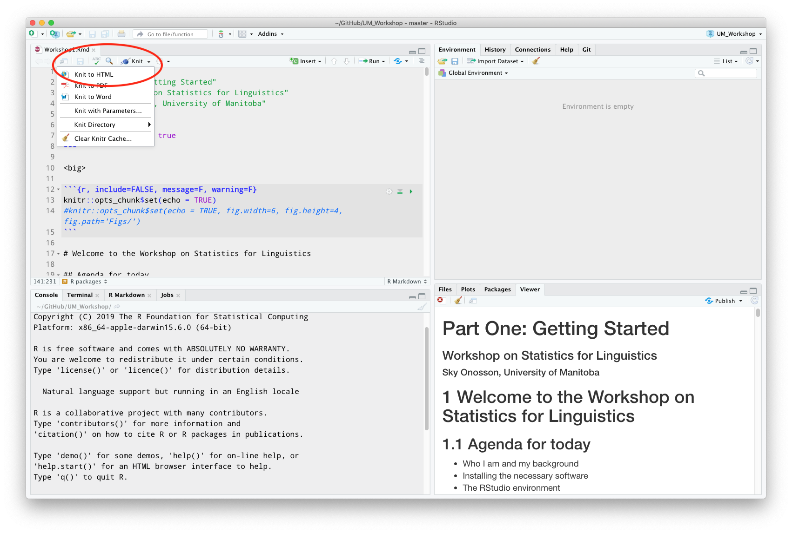

<big>

```{r preliminaries, include=FALSE, message=F, warning=F}
library("knitr")
opts_chunk$set(echo = TRUE)
```

# Welcome to the Workshop on Statistics for Linguistics {-}

**Who is the workshop for?**
This workshop is for people who have “some background in R”, such as writing up code, loading data, and printing plots and graphs. This does not need to be extensive experience, and we will have time to review & refresh your knowledge at the beginning, or throughout as necessary. We are expecting between 12–15 people, although that may change.

**What will the workshop cover?**
The workshop is intended to cover the use of the R programming language to carry out testing of statistical models for the analysis of quantitative linguistic data (hence the title of the workshop), although we will probably look at examples using other data as well, because the tests themselves don’t care where the data comes from or what it’s about.

**What will I need for the workshop?**
Other than bringing yourself of course, you will probably want to bring a laptop with R and RStudio installed. Choice of operating system shouldn’t be that important, but I’ll be using a Mac if anyone cares. I will be running the workshop via my laptop projected on the screen, and you can just observe if you like, but you’re probably not going to get the most out of the workshop that way, so I’m going to just assume everyone will be bringing a functioning laptop.

### Agenda: {-} 

* Who I am and my background
* Installing the necessary software
* The RStudio environment

---

# Who I am and my background

I primarily work in sociophonetics, so the data I am most familiar with are acoustic phonetic measurements, and the types of analysis I do typically involve relating those measurements to social factors of various kinds.

I am not a statistician, and in fact I have never taken a proper statistics or research methods course. I won't claim to be able to give you a definitive account of how best to interpret statistical tests, or how and why one test might be superior to another for some particular dataset. 

What I can do is describe to you how to manage linguistic data in R, how to apply a variety of statistical functions and tests to that data, and how to produce output in a variety of forms which are usable in presentations, talks, papers, etc.

Here's my email address for anyone who doesn't already have it - I'm always happy to discuss issues related to R and linguistics! 
><sky@onosson.com>

---

# Installing the necessary software

## Base software: R & RStudio

The first and most essential software package you require is R itself, which is "a free software environment for statistical computing and graphics". If you don't have R installed, go to <https://muug.ca/mirror/cran/> and download the appropriate version for your operating system:

```{r download_r, echo = FALSE}

```

If you already have R installed, it would be a good idea to open it and make sure it is updated. On a Mac, from the menu bar click:

>`R > Check For R Updates`

(I'm not sure of the procedure for Windows; hopefully it's easy to follow)

After installing R, you will need to install RStudio:

>RStudio is an integrated development environment (IDE) for R. It includes a console, syntax-highlighting editor that supports direct code execution, as well as tools for plotting, history, debugging and workspace management.

It's possible to do everything we will be doing in the workshop using just R on its own, but RStudio makes working with R a lot easier in a variety of ways. Get R here https://rstudio.com/products/rstudio/download/ and install it.

```{r download_rstudio, echo = FALSE}

```

Again, if you already have RStudio you should check for updates. On a Mac, go to: 

>`Help > Check for Updates`

## Getting the workshop files

I am planning to run the entire workshop inside RStudio rather than using Powerpoint or something like that. That way, you will be working hands-on with R the entire time, which will help you to be more familiar with things. I can also adapt the files I am using on the fly during the workshop, and later save those updates for everyone to access.

The files I will be using in the workshop are located here: <https://github.com/onosson/UM_Workshop>

```{r github_files, echo = FALSE}

```

From that page, click `Clone or download` and then select `Download ZIP` (most people) or `Open in Desktop` if you are already on GitHub and use a version control app like GitHub Desktop (if you don't know/understand what that is, it's basically like Dropbox for coders).

Assuming that you downloaded the .zip file, locate it in your computer and unzip it. This will create a folder called `UM_Workshop-master` which contains all of the files for the workshop. I *may* edit/update some of the daily files, but I'll let you know about that as we go along.

Inside the folder is an RStudio project file: `UM_Workshop.Rproj`. Opening that file *should* open up RStudio.

```{r rstudio_window, echo = FALSE}

```

If for some reason this does not work, open RStudio manually, and go to:

>`File > New Project...`

```{r new_project, echo = FALSE}

```

Then click `Existing Directory` and select the location of the folder you downloaded from GitHub.

After going through all of this, you should have an RStudio project window open which has several "panes", which each have a variety of functions. At the bottom right there should be a pane which has several tabs, one of which should be `Files`. If you scroll through that and click on `Workshop1.Rmd`, that file should open in the upper left pane, and we will be all on the same page.

---

# The RStudio environment

RStudio is divided into 4 "panes". The default layout has the source code (where you work with files) in the upper left, and the console (where you work directly in R) in the lower left. The upper right pane contains several tabs, including the Environment where your loaded data items will be listed. The lower right contains access to the Files list, Plots, etc.

## Modifying RStudio

One of the nice things about RStudio is that you can adjust how it looks and operates. I use a non-standard theme which alters the colour scheme, and a non-standard font as well as modifying some of the panes arrangements. This is all done within the RStudio preferences/settings.

```{r rstudio_themes, echo = FALSE}

```

```{r rstudio_panes, echo = FALSE}

```

I find that when I am coding for extended periods of time, it really helps to have a good visual environment.

## R Markdown

The main workshop files are written in R Markdown, which is a "markup" language that can generate a variety of document types including .html, .pdf, .doc etc. using simplified syntax. One of its nicest features is that you can include "chunks" of R code within the document text, which can be run inside of RStudio. This not only generates output, but lets you work with the code directly, which is why I am using this format for the workshop. In order to run R Markdown files properly, you may need to install some R packages.

>Since you should now have the .rmd file loaded in RStudio, you are currently reading R Markdown code -- hopefully you can see how "light" of a coding language it is.

Navigating Markdown documents can be done using the selection button at the bottom left of the Source pane (where R files open in RStudio). Headings and "chunks" of code will be listed there.

```{r}

```

## R packages

Packages are bundles of functions (and sometimes data) which are downloaded into R and allow you to do many different things that "Base R" doesn't provide easy access to. In order to install a package in R, there are two methods:

**1.** Enter code in the `Console` tab in the lower left pane of RStudio. This is where you work directly with R, and is identical to running the R app on its own. to install the `markdown` package, enter the following code into the console and press return/enter

 >`install.packages("rmarkdown")`

 If you get an error message, that just means you already have the package installed.

**2.** Go to the `packages` tab in the lower right pane. Click the `install` button and type the package name, in this case `rmarkdown`. In most cases, you will want to use the CRAN repository, and have `Install dependencies` checked. Click `Install` and the package will be installed into R.

Installing packages makes them available, but by default when you start an R session user-installed packages are not loaded. To do this, use the `library()` function as in the following code snippet:

```{r library_rmarkdown}
library("rmarkdown")
```

Finally, once you have the `rmarkdown` package installed and loaded, and you have an .Rmd file open, you can "knit" it into a formatted document for viewing. To do this, click the `Knit` dropdown menu at the top of the .Rmd file, and (in this case) select `Knit to HTML`.

```{r knit_to_html, echo = FALSE}

```

This may take a little time and you will see R running in the Console tab in the lower left pane, but eventually an html document will open up in the Viewer tab in the lower right pane (it may expand to fill the whole right side).

## Using packages and cheat sheets

There is an almost unlimited amount of information out there relating to R coding, way too much to try and retain in memory (at least for me), and new packages are being developed and released all the time. 

The Help tab in the upper right pane lets you search through your installed packages and functions, and view their documentation. These typically include descriptions, implementation in R code, and examples of usage.

Another excellent resource are the various "cheat sheets" which are available for a variety of packages, or for R and RStudio themselves. <https://rstudio.com/resources/cheatsheets/> hosts many useful cheat sheets, and I have included several in Workshop folder `UM_Workshop/cheatsheets` for easy access, including "Base R", "RStudio IDE", "Data Transformation with dplyr", "Data visualization with ggplot2" and "R Markdown".

</big>