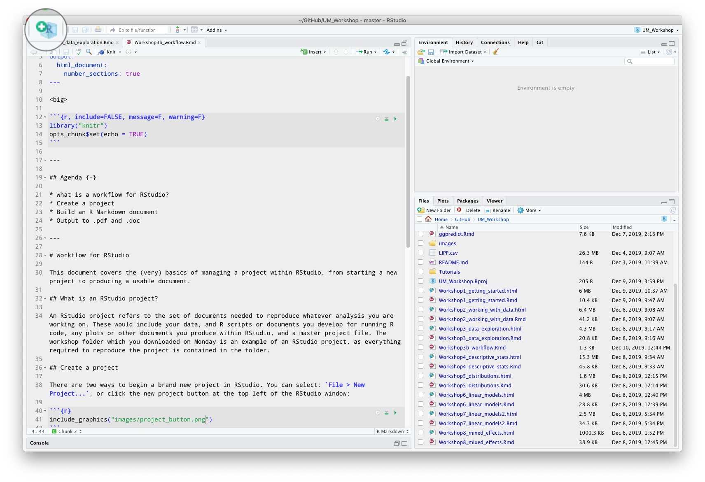
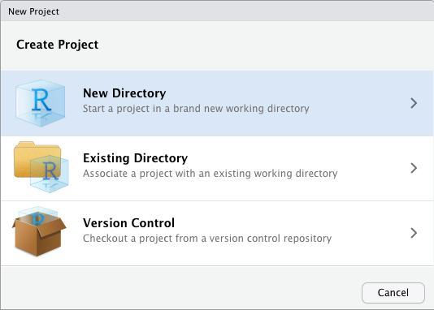
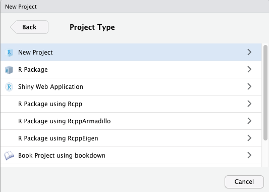
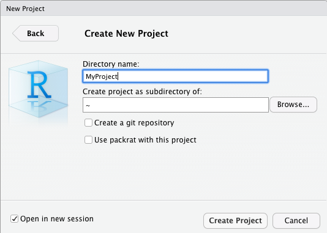
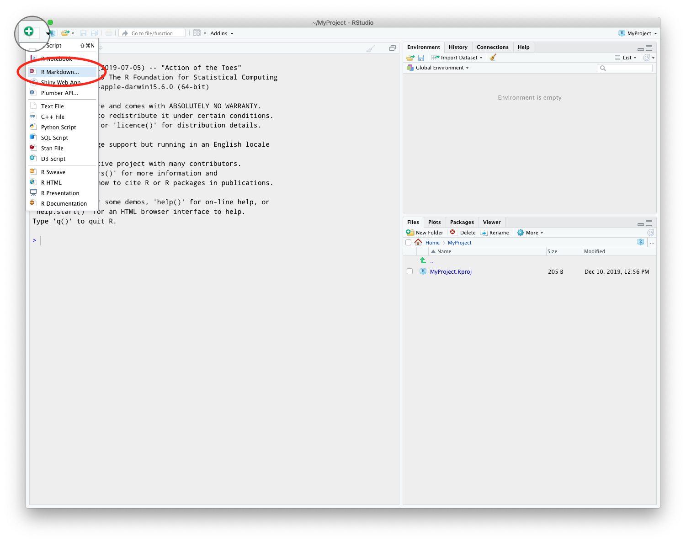
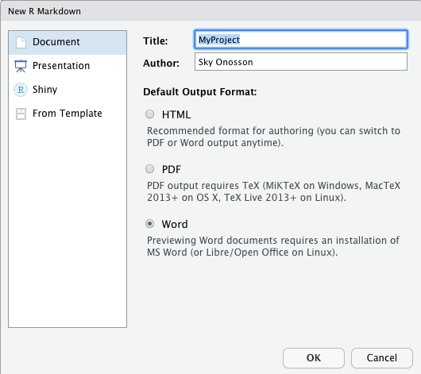
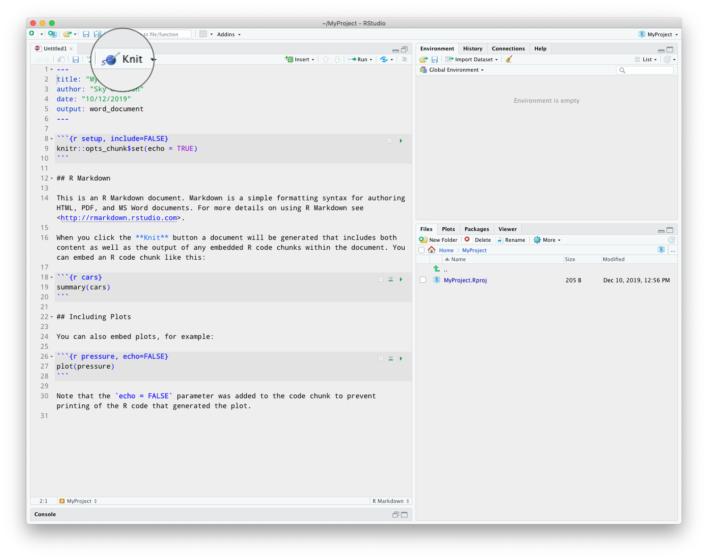
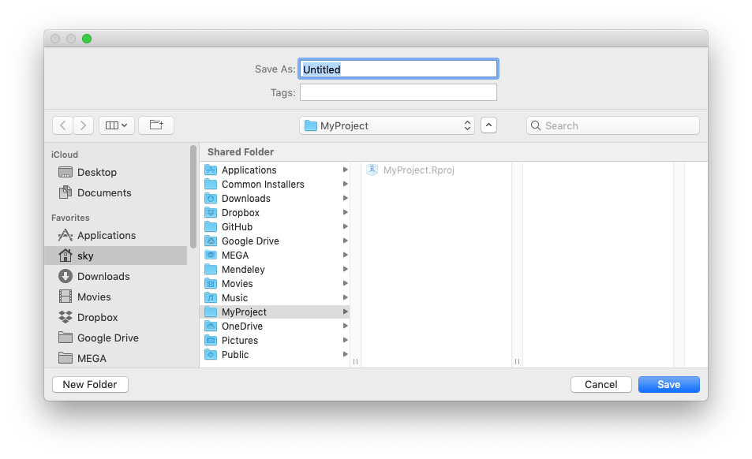

<big>

```{r, include=FALSE, message=F, warning=F}
library("knitr")
opts_chunk$set(echo = TRUE)
```

---

## Agenda {-}

* What is a workflow for RStudio?
* Create a project
* Build an R Markdown document
* Output to .pdf and .doc

---

# Workflow for RStudio {-}

This document covers the (very) basics of managing a project within RStudio, from starting a new project to producing a usable document.

# What is an RStudio project?

An RStudio project refers to the set of documents needed to reproduce whatever analysis you are working on. These would include your data, and R scripts or documents you develop for running R code, any plots or other documents you produce within RStudio, and a master project file. The workshop folder which you downloaded on Monday is an example of an RStudio project, as everything required to reproduce the project is contained in the folder.

# Create a project 

There are two ways to begin a brand new project in RStudio. You can select: `File > New Project...`, or click the new project button at the top left of the RStudio window:

```{r project_button}

```

You will be presented with several options for your project: to use a New Directory, and Existing Directory, or Version Control. The first is when you do not have any existing files or folders set up, the second option is for when you already have some files and they are located within the same folder (if they aren't set up that way, do so before proceeding). If you don't know what "version control" is, then don't worry about the last option. Let's go with a New Directory:

```{r new_directory}

```

Next you will select the type of project -- most of these are options you will not need to use unless you are much more advanced in R. Select "New Project":

```{r project_type}

```

Finally, you will need to provide a name for your project and tell it where to put the folder. The checkbox at the bottom left allows you to choose to open the new project in a new window, or use the window you are currently in -- if you leave the box unchecked, your current project will be closed, so make sure it's checked for now:

```{r create_project}

```

# Create an RMarkdown document

The first thing we will do in the new project is to create an RMarkdown document. By doing this, we can develop the entire project within a single piece of code which will eventually produce a document such as a .pdf or .docx file. Click the New File button at the top left (next to the New Project button) and select "R Markdown...":

```{r r_markdown}

```

You can enter a title, and select a default output type -- don't worry, you can always output to other types, no matter which default you select. Let's use Word since that is a pretty commonly-used format.

>*The title you enter here is only for the output document - your R Markdown file will begin as simply "Untitled1".*

```{r new_r_markdown}

```

# Output to a document

You will see that your new Markdown file is not empty! By default, R creates a file with some text and R code already embedded in it, which means that you can immediately "knit" this file to produce a document. Let's try this right now by clicking the "Knit" button:

```{r knit_markdown}

```

First, you will get a prompt to name your R Markdown file. Give it a name and save it:

```{r untitled}

```

After a moment, R will have produced a .docx file based on the code in the Markdown document. On a Mac, this should immediately open up in Preview (I'm not sure what Windows does). The .docx file is also immediately saved in the main project folder we created at the beginning, and you can open and edit this in Word.

You can also change your Knit output to be either .html or .pdf instead -- note however, that it will not look the same in every format. I recommend looking at the Markdown cheatsheet for some of the further options as to what can be done with these files.

# Closing your project

When you are done working on your project, you can close the RStudio window -- this will give you a prompt to save the project file. Note that the project file, which ends in `.Rproj`, is a separate file which is saved in the main project folder we created at the beginning. It does not contain any data or R code which you worked on, those are separate files. The project file merely tells RStudio where the project files are located, and which ones were open the last time you saved the project. Note also that when you close a project, even if you save it, all of the Objects stored in memory will be gone. That's why it is important to write and save your code in an R file such as the Markdown file we created, so that you can retrieve it in the future!

> You can also write R code in an "R script" file rather than a Markdown file. The difference is that R script files with a `.R` extension are **only** R code -- they do not produce output to other file types, and should not contain anything not written in R code. Depending how you plan to work with your project, you may want to use one or the other.

</big>