<big>

```{r, include=FALSE, message=F, warning=F}
library("knitr")
opts_chunk$set(echo = TRUE)
```

---

## Agenda {-}

* Linear Models (tutorial by Bodo Winter)

---

## Load required packages and data {-}

```{r preliminaries, message=F, warning=F}
if(!require(tidyverse)){install.packages("tidyverse")}
library(tidyverse)
```

# Linear Modeling {-}

We already looked at linear models, but for the sake of completeness I wanted to include this excellent tutorial by Bodo Winter: <http://www.bodowinter.com/uploads/1/2/9/3/129362560/bw_lme_tutorial1.pdf>. The source data used is available from: <http://www.bodowinter.com/uploads/1/2/9/3/129362560/politeness_data.csv>. 

A couple of notes are in order before beginning:

1. The URL for the data file has changed since the .pdf was written -- I have updated it in the tutorial below to represent the current location. A copy is also currently available in a GitHub repository maintained by Hyuksu Ryu: <https://github.com/HyuksuRyu/mixedLM_tutorial>

1. I have not been able to locate any source code for Winter's tutorial, so I have adapted his R code to run in Markdown, including some ggplot adaptations of his plots.

Bodo Winter's tutorial begins here:

---

# Linear models and linear mixed effects models in R: Tutorial 1 (Bodo Winter) {-}

Linear models and linear mixed models are an impressively powerful and flexible tool for understanding the world. This tutorial is the first of two tutorials that introduce you to these models. The tutorials are decidedly conceptual and omit a lot of the more involved mathematical stuff. The focus is on understanding what these models are doing ... and then we’ll spend most of the time applying this understanding. The idea is to bootstrap your knowledge as quickly as possible so that you can start with your own analyses and then turn to more technical texts if needed.

You’ll need about 1 hour to complete this tutorial (maybe a bit more).

---

So, what does the linear model do? Assume you knew nothing about males and females, and you were interested in whether the voice pitch of males and females differs, and if so, by how much.

So you take a bunch of males and a bunch of females, and ask them to say a single word, say “mama”, and you measure the respective voice pitches. Your data might look something like this:

|Subject|Sex|Voice.Pitch|
|---|---|---|
|1| female|233 Hz|
|2| female|204 Hz| 
|3| female|242 Hz |
|4| male|130 Hz|
|5| male|112 Hz|
|6| male|142 Hz|

“Hz” (Hertz) is a measure of pitch where higher values mean higher pitch.
You might look at this table and say that it’s quite obvious that females have higher voice pitch than males. After all, the female values seem to be about 100 Hz above the male ones.

But, in fact, it could be the case that females and males have the same pitch, and you were just unlucky and happened to choose some exceptionally high-pitched females and some exceptionally low-pitched males. Intuitively, the pattern in the table seems pretty straightforward, but we might want a more precise estimate of the difference between males and females, and we might also want an estimate about how likely (or unlikely) that difference in voice pitch could have arisen just because of drawing an unlucky sample.

This is where the linear model comes in. In this case, its task is to give you some values about voice pitch for males and females... as well as some probability value as to how likely those values are.

The basic idea is to express your relationship of interest (in this case, the one between sex and voice pitch) as a simple formula... such as this one:

`pitch ~ sex`

This reads “pitch predicted by sex” or “pitch as a function of sex”. Some people call the thing on the left the “dependent variable” (the thing you measure) and the thing on the right the “independent variable”. Others call the thing on the right the “explanatory variable” (this sounds too causal to me) or the “predictor”. I’ll call it “fixed effect”, and this terminology will make sense later on in tutorial 2.

Now, the world isn’t perfect. Things aren’t quite as deterministic as the above formula suggests. Pitch is not completely determined by sex, but also by a bunch of different factors such as language, dialect, personality, age and what not. Even if we measured all of these factors, there would still be other factors influencing pitch that we cannot control for. Perhaps, a subject in your data had a hangover on the morning of the recording (causing the voice to be lower than usual), or the subject was just more nervous on that particular day (causing the voice to be higher). We can never measure and control all of these things. The world is full of stuff that is outside the purview of our little experiment. Hence, let’s update our formula to capture the existence of these “random” factors.

`pitch ~ sex + ε`

This “ε” (read “epsilon”) is an error term. It stands for all of the things that affect pitch that are not sex, all of the stuff that – from the perspective of our experiment – is random or uncontrollable.

The formula above is a schematic depiction of the linear model that we’re going to build. Note that the part of the formula on the right-hand side conceptually divides the world into stuff that you can understand (the “fixed effect” sex) and stuff that you can’t understand (the random part “ε”). You could call the former the “structural” or “systematic” part of your model and the latter the “random” or “probabilistic” part of the model.

# Hands-on exercise: Let’s start! {-}

O.k., let’s move to R, the statistical programming environment that we’ll use for the rest of this tutorial2. Let’s create the dataset that we’ll use for our analysis. Type in:

```{r ex1}
     pitch = c(233,204,242,130,112,142)
     sex = c(rep("female",3),rep("male",3))
```

The first line concatenates our 6 data points from above and saves it in an object that we named pitch. The second line repeats the word “female” 3 times and then the word “male” 3 times ... and concatenates these 6 words into an object that we named sex.

For a better overview, let’s combine these two objects into a data frame:

```{r my.df}
my.df = data.frame(sex,pitch)
```

Now we have a data frame object that we named my.df, and if you type that,
you’ll see this:

```{r view_my.df}
my.df
```

O.k., now we’ll proceed with the linear model. We take our formula above and feed it into the lm() function ... except that we omit the “ε” term, because the linear model function doesn’t need you to specify this.

```{r xmdl}
     xmdl = lm(pitch ~ sex, my.df)
```

We modeled pitch as a function of sex, taken from the data frame my.df ... and we saved this model into an object that we named xmdl. To see what the linear model did, we have to “summarize” this object using the function summary():

```{r summary}
     summary(xmdl)
```

Lots of stuff here. First, you’re being reminded of the model formula that you entered. Then, the model gives you the residuals (what this is will be discussed later), and the coefficients of the fixed effects (again, explanations follow... bear with me for a moment). Then, the output prints some overall results of the model that you constructed.

We have to work through this output. Let’s start with “Multiple R-Squared”. This refers to the statistic R2 which is a measure of “variance explained” or if you prefer less causal language, it is a measure of “variance accounted for”. R2 values range from 0 to 1. Our R2 is 0.921, which is quite high ... you can interpret this as showing that 92.1% of the stuff that’s happening in our dataset is “explained” by our model. In this case, because we have only one thing in our model doing the explaining (the fixed effect “sex”), the R2 reflects how much variance in our data is accounted for by differences between males and females.

In general, you want R2 values to be high, but what is considered a high R2 value depends on your field and on your phenomenon of study. If the system you study is very deterministic, R2 values can approach 1. But in most of biology and the social sciences, where we study complex or messy systems that are affected by a whole bunch of different phenomena, we frequently deal with much lower R2 values.

The “Adjusted R-squared” value is a slightly different R2 value that not only looks at how much variance is “explained”, but also at how many fixed effects you used to do the explaining. So, in the case of our model above, the two values are quite similar to each other, but in some cases the adjusted R2adj can be much lower if you have a lot of fixed effects (say, you also used age, psychological traits, dialect etc. to predict pitch).

So much for R2. Next line down you see the thing that everybody is crazy for: Your statistical test of “significance”. If you’ve already done research, your eyes will probably immediately jump to the p-value, which in many fields is your ticket for publishing your work. There’s a little bit of an obsession with p-values ... and even though they are regarded as so important, they are quite often misunderstood! So what exactly does the p-value mean here?

One way to phrase it is to say that assuming your model is doing nothing, the probability of your data is relatively low (because the p-value is small in this case). Technically speaking, the p-value is a conditional probability, it is a probability under the condition that the null hypothesis is true. In this case, the null hypothesis is “sex has no effect on pitch”. And, the linear model shows that if this hypothesis is true, then the data would be quite unlikely. This is then interpreted as showing that the alternative hypothesis “sex affects pitch” is more likely and hence that your result is “statistically significant”.

Usually, however, you have to distinguish between the significance of the overall model (the p-value at the very bottom of the output), which considers all effects together, from the p-value of individual coefficients (which you find in the coefficients table above the overall significance). We’ll talk more about this in a bit.

Then comes the F-value and the degrees of freedom. For an explanation of this, see my tutorial on ANOVAs and the logic behind the F-test (http://bodowinter.com/tutorial/bw_anova_general.pdf). For a general linear model analysis, you probably need this value to report your results. If you wanted to say that your result is “significant”, you would have to write something like this:

>“We constructed a linear model of pitch as a function of sex. This model was significant (F(1,4)=46.61, p<0.01). (...)”

Now, let’s look at the coefficient table. Here it is again:

```{r summary_coeff}
     summary(xmdl)[4]
```

Note that the p-value for the overall model was p=0.002407, which is the same as the p-value on the right-hand side of the coefficients table in the row that starts with “sexmale”. This is because your model had only one fixed effect (namely, “sex”) and so the significance of the overall model is the same as the significance for this coefficient. If you had multiple fixed effects, then the significance of the overall model and the significance of this coefficient would be different. That is because the significance of the overall model takes all fixed effects (all explanatory variables) into account whereas the coefficients table looks at each fixed effect individually.

But why does it say “sexmale” rather than just “sex”, which is how we named our fixed effect? And where did the females go? If you look at the estimate in the row that starts with “(Intercept)”, you’ll see that the value is 226.33 Hz. This looks like it could be the estimated mean of the female voice pitches. If you type the following...

```{r mean_female}
     mean(my.df[my.df$sex=="female",]$pitch)
```

... you’ll get the mean of female voice pitch values, and you’ll see that this value is very similar to the estimate value in the “(Intercept)” column.
Next, note that the estimate for “sexmale” is negative. If you subtract the estimate in the first row from the second, you’ll get 128, which is the mean of the male voice pitches (you can verify that by repeating the above command and exchanging “male” for “female”).

To sum up, the estimate for “(Intercept)” is the estimate for the female category, and the estimate for “sexmale” is the estimate for the difference between the females and the male category. This may seem like a very roundabout way of showing a difference between two categories, so let’s unpack this further.

Internally, linear models like to think in lines. So here’s a picture of the way the linear model sees your data:

```{r winter3}
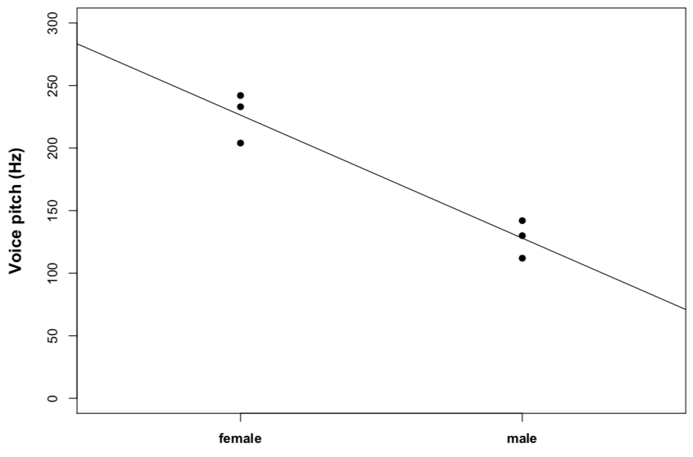
```

The linear model imagines the difference between males and females as a slope. So, to go “from females to males”, you have to go down –98.33 ... which is exactly the coefficient that we’ve seen above. The internal coordinate system looks like this:

```{r winter4}
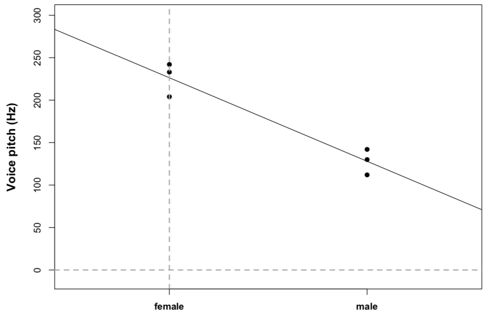
```

Females are sitting at the x-coordinate zero at the y-intercept (the point where the line crosses the y-axis), and males are sitting at the x-coordinate 1. So now, the output makes a hella more sense to us:

```{r summary_xmdl}
     summary(xmdl)[4]
```

The females are hidden behind this mysterious “(Intercept)” and the estimate for that intercept is the estimate for female voice pitch! Then, the difference between females and males is expressed as a slope... “going down” by 98.33. The p-values to the right of this table correspond to tests whether each coefficient is “non- zero”. Obviously, 226.33 Hz is different from zero, so the intercept is “significant” with a very low p-value. The slope -98.33 is also different from zero (but in the negative direction), and so this is significant as well.

You might ask yourself: Why did the model choose females to be the intercept rather than males? And what is the basis for choosing one reference level over the other? The lm() function simply takes whatever comes first in the alphabet! “f” comes before “m”, making “females” the intercept at x=0 and “males” the slope of going from 0 to 1.

It might not appear straightforward to you why we can express categorical differences (here, between men and women) as a slope. The reason why this works is because the difference between two categories is exactly correlated with the slope between two categories. The following figures will help you realize this fact. In those pictures, I increased the distance between two categories ... and exactly proportional to this increase in distance, the slope increased as well.

```{r winter5}
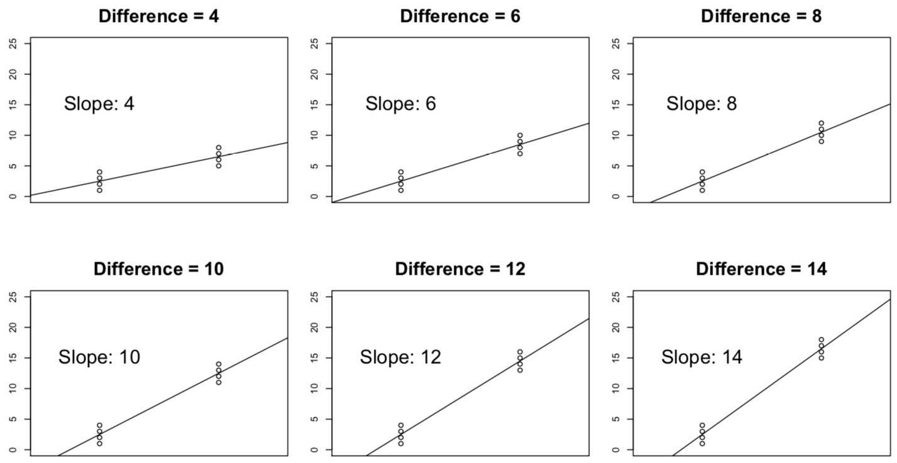
```

What’s the big advantage of thinking of the difference between two categories as a line crossing those two categories? Well, the big advantage is that you can use the same principle for something that is not categorical. So, if you had a continuous factor, say age, you could also fit a line. Everything would work exactly the same. Let’s try this out. Say you were now interested in whether age predicts voice pitch. The data might look something like this:

|Subject| Age|Voice.Pitch|
|---|---|---|
|1| 14|252 Hz |
|2| 23|244 Hz|
|3| 35| 240 Hz|
|4| 48| 233 Hz|
|5| 52| 212 Hz| 
|6| 67|204 Hz|

```{r winter6}
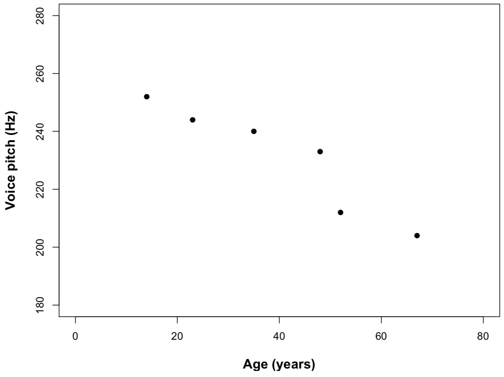
```

O.k., same thing as before: We express this as a function, where our “fixed effect” is now “age”.

`pitch ~ age + ε`

Let’s construct the data in R and run the model:

```{r age_pitch}
     age = c(14,23,35,48,52,67)
     pitch = c(252,244,240,233,212,204)
     my.df = data.frame(age,pitch)
     xmdl = lm(pitch ~ age, my.df)
     summary(xmdl)
```

In the output, let’s focus on the coefficients:

```{r xmdl_coeffs}
     summary(xmdl)[4]
```

Again, the significance of the intercept is not very interesting. Remember that the p-value in each row is simply a test of whether the coefficient to the left is significantly different from zero. The intercept (267.0765) here is the predicted pitch value for people with age 0. This intercept doesn’t make much sense because people who are not born yet don’t really have voice pitch.

What really interests us is “age”, which emerges as a significant “predictor” of voice pitch. The way to read the output for age (“-0.9099“) is that for every increase of age by 1 you decrease voice pitch by 0.9099 Hertz. Easy-peasy: just go one step to the right in your graph (in your unit of measurement, here: age in years) and one step down (in your unit of measurement, here: voice pitch in Hz).

The scatterplot below neatly summarizes the model: The line represents the mean that the model predicts for people at age 0, 1, 2, 3 etc. This is the line that represents the coefficients of the model. It’s worth looking at this picture and comparing it to the coefficients table above. See that the line at x=0 is 267.0765 (our intercept), and the slope is -0.9099.

```{r age_pitch_lm}
ggplot(my.df, aes(age, pitch)) +
  geom_point() +
  geom_smooth(method = "lm", se = FALSE)
```

## Meaningful and meaningless intercepts {-}

You might want to remedy the above-discussed situation that the intercept is meaningless. One way of doing this would be to simply subtract the mean age from each age value, as is done below:

```{r age.c}
     my.df$age.c = my.df$age - mean(my.df$age)
     xmdl = lm(pitch ~ age.c, my.df)
     summary(xmdl)
```
     
Here, we just created a new column “age.c” that is the age variable with the mean subtracted from it. This is the resulting coefficient table from running a linear model analysis of this “centered” data:

```{r age.c_coeffs}
     summary(xmdl)[4]
```

Note that while the estimate has changed from 267.0765 (predicted voice pitch at age 0) to 230.8333 (predicted voice pitch at average age), the slope hasn’t changed and neither did the significance associated with the slope or the significance associated with the full model. That is, you haven’t messed at all with the nature of your model, you just changed the metric so that the intercept is now the mean voice pitch. So, via centering our variable we made the intercept more meaningful.

## Going on {-}

Both of these examples have been admittedly simple. However, things easily “scale up” to more complicated stuff. Say, you measured two factors (“age” and “sex”) ... you could put them in the same model. Your formula would then be:

`pitch ~ sex + age + ε`

Or, you could add dialect as an additional factor:

`pitch ~ dialect + sex + age + ε`

And so on and so on. The only thing that changes is the following. The p-value at the bottom of the output will be the p-value for the overall model. This means that the p-value considers how well all of your fixed effects together help in accounting for variation in pitch. The coefficient output will then have p-values for the individual fixed effects.

This is what people sometimes call “multiple regression”, where you model one response variable as a function of multiple predictor variables. The linear model is just another word for multiple regression.

# Don’t stop here!!! {-}

## Assumptions{-}

There’s a reason why we call the linear model a model. Like any other model, the linear model has assumptions ... and it’s important to talk about these assumptions. So here’s a whirlwind tour through the conditions that have to be satisfied in order for the linear model to be meaningful:

### (1) Linearity {-}

It’s called “linear model” for a reason! The thing to the left of our simple formula above has to be the result of a linear combination of the things on the right. If it doesn’t, the residual plot will indicate some kind of curve, or it will indicate some other pattern (e.g., two lines if you have categorical binary data).

We haven’t talked about residual plots yet, let alone residuals. So, let’s do that! Have a look at the picture below, which is a depiction of the age/pitch relationship again:

>**Note from Sky:** This is another way of making a linear plot which differs from the previous workshop page. I adapted some of the code from this page to make this plot: <https://drsimonj.svbtle.com/visualising-residuals>

```{r residuals_plot}
fit <- lm(pitch ~ age, data = my.df)

my.df$predicted <- predict(fit)  
my.df$residuals <- residuals(fit)

ggplot(my.df, aes(age, pitch)) +
  geom_segment(aes(xend = age, yend = predicted), colour = "red") +
  geom_point() +
  geom_point(aes(y = predicted), shape = 1) +
  geom_smooth(method = "lm", se = FALSE, colour = "black", linetype = "dashed")
```

The red lines indicate the residuals, which are the deviations of the observed data points from the predicted values (the so-called “fitted values”). In this case, the residuals are all fairly small ... which is because the line that represents the linear model predicts our data very well, i.e., all points are very close to the line.

To get a better view of the residuals, you can take a snapshot of this graph like this...

```{r winter7}
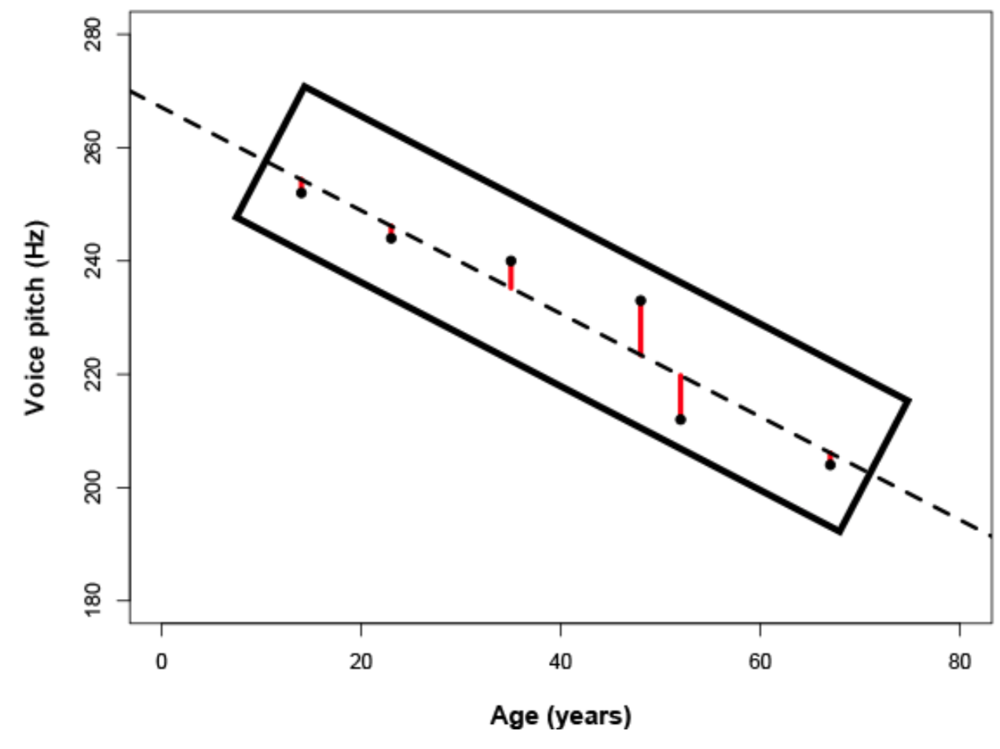
```

... and rotate it over. So, you make a new plot where the line that the model predicts is now the center line. Like here:

```{r winter8}
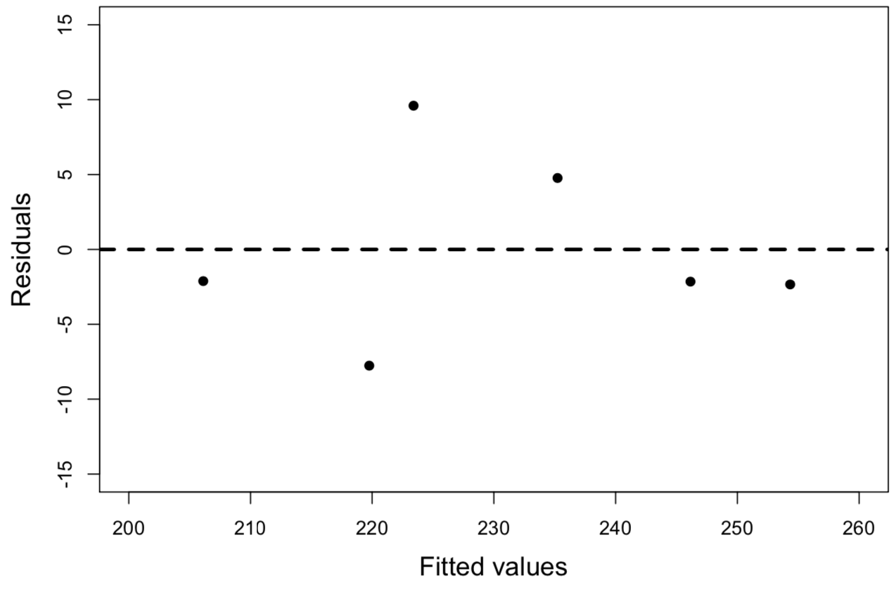
```

This is a residual plot. The fitted values (the predicted means) are on the horizontal line (at y=0). The residuals are the vertical deviations from this line.

This view is just a rotation of the actual data (compare the residual plot with the scatterplot to see this). To construct the residual plot for yourself, simply type:

>*Your plot will have no central line and it will have different scales. It’s worth spending some time on tweaking your residual plot and making it pretty... in particular, you should make the plot so that there’s more space around the margins. This will make any patterns easier to see. Have a look at some R graphic tutorials for this.*

```{r fitted_residuals}
     plot(fitted(xmdl),residuals(xmdl))
```

In this case... there isn’t any obvious pattern in the residuals. If there were a nonlinear or curvy pattern, then this would indicate a violation of the linearity assumption. Here’s an example of a residual plot that clearly shows a violation of linearity:

```{r winter9}
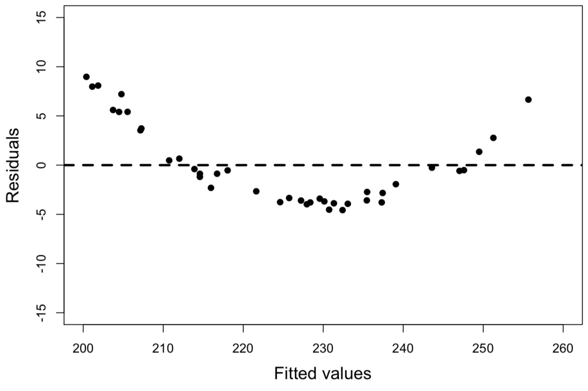
```

What to do if your residual plot indicates nonlinearity? There’s several options:

* You might miss an important fixed effect that interacts with whatever fixed effects you already have in your model. Potentially the pattern in the residual plot goes away if this fixed effect is added.
* Another (commonly chosen) option is to perform a nonlinear transformation of your response, e.g., by taking the log-transform.
* You can also perform a nonlinear transformation of your fixed effects. So, if age were somehow related to pitch in a U-shaped way (perhaps, if very young people had high pitch and very old people had high pitch, too, with intermediate ages having a “dip” in pitch), then you could add age and age2 (age-squared) as predictors.
* Finally, if you’re seeing stripes in your residual plot, then you’re most likely dealing with some kind of categorical data – and you would need to turn to a somewhat different class of models, such as logistic models.

### (2) Absence of collinearity {-}

When two fixed effects (two predictors) are correlated with each other, they are said to be collinear. Say, you were interested in how average talking speed affects intelligence ratings (i.e., people who talk more quickly are rated to be more intelligent)...

`intelligence ratings ~ talking speed`

... and you measured several different indicators of talking speed, for example, your syllables per seconds, words per seconds and sentences per seconds. These different measures are going to be correlated with each other because if you speak more quickly, then you say more syllables, words and sentences in a given amount of time. If you were to use all of these correlated predictors to predict intelligence ratings within the same model, you are likely going to run into a collinearity problem.

If there’s collinearity, the interpretation of the model becomes unstable: Depending on which one of correlated predictors is in the model, the fixed effects become significant or cease to be significant. And, the significance of these correlated or collinear fixed effects is not easily interpretable, because they might steal each other’s “explanatory power” (that’s a very coarse way of saying what’s actually going on, but you get the idea).

Intuitively, this makes a lot of sense: If multiple predictors are very similar to each other, then it becomes very difficult to decide what, in fact, is playing a big role.

How to get rid of collinearity? Well first of all, you might pre-empt the problem in the design stage of your study and focus on a few fixed effects that you know are not correlated with each other. If you didn’t do this and you have several multiple measures to choose from at the analysis stage of your study (e.g., three different ways of measuring “talking speed”), think about which one is the most meaningful and drop the others (be careful here: don’t base this dropping decision on the “significance”). Finally, you might want to consider dimension- reduction techniques such as Principal Component Analysis. These can transform several correlated variables into a smaller set of variables which you can then use as new fixed effects.

### (3) Homoskedasticity ... or “absence of heteroskedasticity” {-}

Being able to pronounce “heteroskedasticity” several times in a row in quick succession will make you a star at your next cocktail party, so go ahead and rehearse pronouncing them now!

Jokes aside, homoskedasticity is an extremely important assumption. It says that the variance of your data should be approximately equal across the range of your predicted values. If homoscedasticity is violated, you end up with heteroskedasticity, or, in other words, a problem with unequal variances.

For the homoscedasticity assumption to be met, the residuals of your model need to roughly have a similar amount of deviation from your predicted values. Again, we can check this by looking at a residual plot. Here’s the one for the age/pitch data again:

```{r fitted_resid}
     plot(fitted(xmdl),residuals(xmdl))
```

There’s not really that many data points to tell whether this is really homoscedastic. In this case, I would conclude that there’s not enough data to safely determine whether there is or isn’t heteroskedasticity. Usually, I would construct models for much larger data sets anyway.

So, here’s a plot that gives you an idea of how a “good” residual plot looks with more data:

```{r winter10}
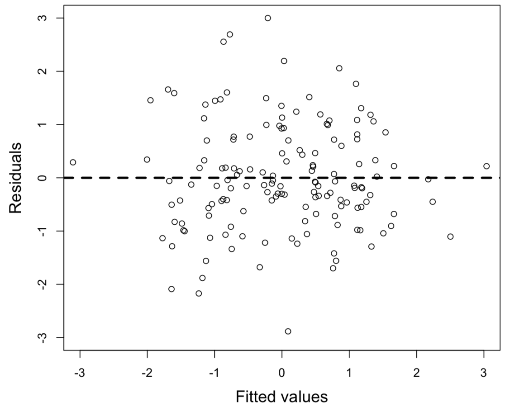
```

And another one:

```{r winter11}
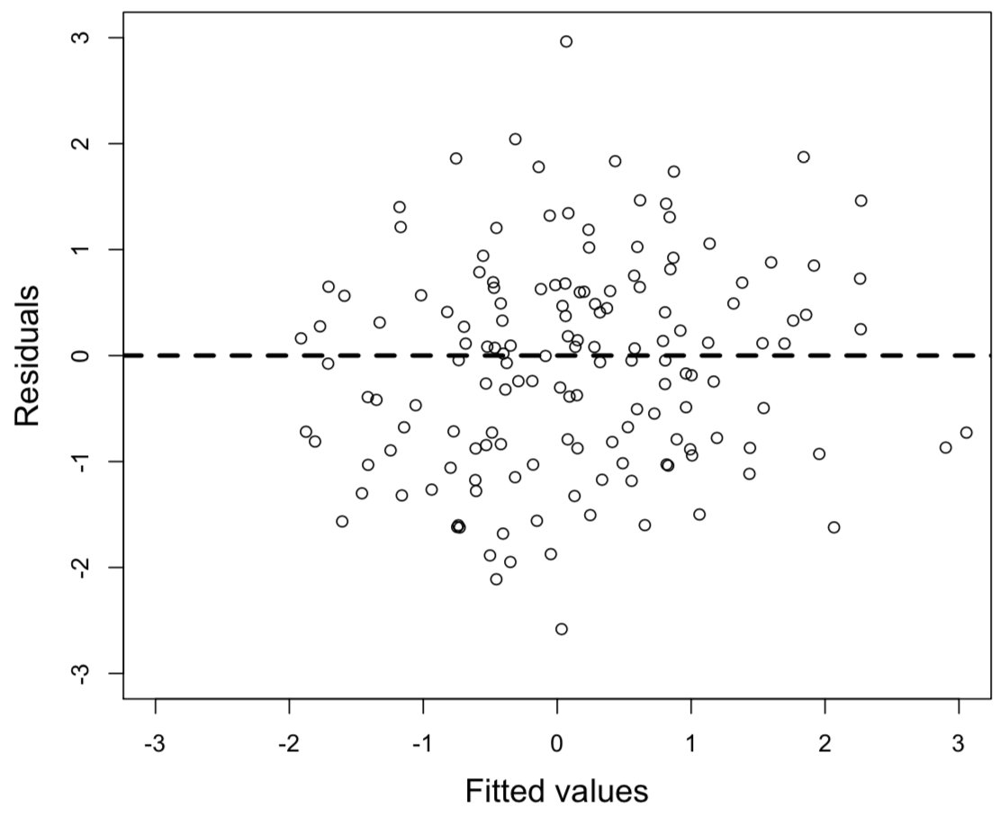
```

A good residual plot essentially looks blob-like. It’s a good idea to generate some random data to see how a plot with roughly equal variances looks like. You can do so using the following command line:

```{r rnorm}
     plot(rnorm(100),rnorm(100))
```

This creates two sets of 100 normally distributed random numbers with a mean of 0 and a standard deviation of 1. If you type this in multiple times to create multiple plots, you can get a feel of how a “normal” residual plot should look like.

The next residual plot shows obvious heteroskedasticity:

```{r winter12}
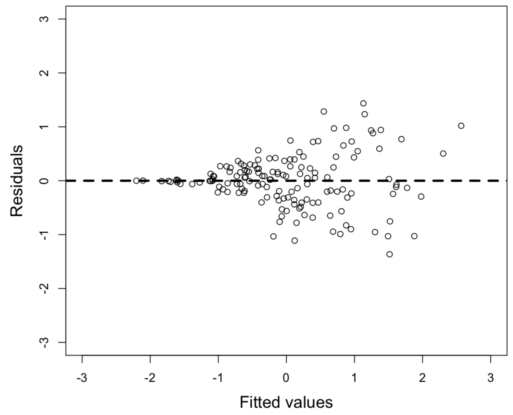
```

In this plot, higher fitted values have larger residuals ... indicating that the model is more “off” with larger predicted means. So, the variance is not homoscedastic: it’s smaller in the lower range and larger in the higher range.

What to do? Again, transforming your data often helps. Consider a log-transform here as well.

### (4) Normality of residuals {-}

The normality of residuals assumption is the one that is least important. Interestingly, many people seem to think it is the most important one, but it turns out that linear models are relatively robust against violations of the assumptions of normality. Researchers differ with respect to how much weight they put onto checking this assumption. For example, Gellman and Hill (2007), a famous book on linear models and mixed models, do not even recommend diagnostics of the normality assumption (ibid. 46).

If you wanted to test the assumption, how would you do this? Either you make a histogram of the residuals of your model, using...

```{r hist}
     hist(residuals(xmdl))
```

... or a Q-Q plot ...

```{r qq}
     qqnorm(residuals(xmdl))
```

Here’s a residual plot and a Q-Q plot of the same residuals next to each other.

```{r winter13}
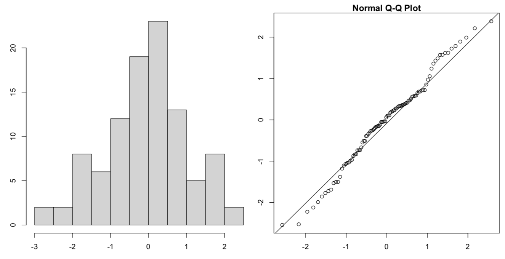
```

### (5) Absence of influential data points {-}

Some people wouldn’t call “the absence of influential data points” an assumption of the model. However, influential data points can drastically change the interpretation of your results, and similar to collinearity, it can lead to instable results.

How to check? Here’s a useful R function, dfbeta(), that you can use on a model object like our xmdl from above.

```{r dfbeta}
dfbeta(xmdl)
```

For each coefficient of your model (including the intercept), the function gives you the so-called DFbeta values. These are the values with which the coefficients have to be adjusted if a particular data point is excluded (sometimes called “leave-one-out diagnostics”). More concretely, let’s look at the age column in the data frame above. The first row means that the coefficient for age (which, if you remember, was -0.9099) has to be adjusted by 0.06437573 if data point 1 is excluded. That means that the coefficient of the model without the data point would be -0.9742451 (which is -0.9099 minus 0.06437573... if the slope is negative, DFbeta values are subtracted, if it’s positive, they are added).

There’s a little bit of room for interpretation in what constitutes a large or a small DFbeta value. One thing you can say for sure: Any value that changes the sign of the slope is definitely an influential point that warrants special attention... because excluding that point would change the interpretation of your results. What I then do is to eyeball the DFbetas and look for values that are different by at least half of the absolute value of the slope. Say, my slope would be 2 ... then a DFbeta value of 1 or -1 would be alarming to me. If it’s a slope of -4, a DFbeta value of 2 or -2 would be alarming to me.

How to proceed if you have influential data points? Well, it’s definitely not legit to simply exclude those points and report only the results on the reduced data set. A better approach would be to run the analysis with the influential points and then again without the influential points ... then you can report both analyses and state whether the interpretation of the results does or doesn’t change. The only case when it is o.k. to exclude influential points is when there’s an obvious error with them, so for example, a value that doesn’t make sense (e.g., negative age, negative height) or a value that obviously is the result due to a technical error in the data acquisition stage (e.g., voice pitch values of 0). Influence diagnostics allow you to spot those points so you can then go back to the original data and see what went wrong.

>*For an interesting back-and-forth on a particular example of how much influence diagnostics and extreme values can change the interpretation of a study, have a look at the delightful episode of academic banter between Ullrich and Schlüter (2011) and Brandt (2011).*

### (6) Independence !!!!!!! {-}

The independence assumption is by far the most important assumption of all statistical tests. In the linear model analyses that we did so far, each data point came from a different subject. To remind you, here’s our two data sets that we worked on:

|Study 1<br>Subject|Sex   |Voice.Pitch|Study 2<br>Subject|Age|Voice.Pitch|
|-----|----|---------|-----|-|---------|
|1      |female|233 Hz     |1      |14 |252 Hz     |
|2      |female|204 Hz     |2      |23 |244 Hz     |
|3      |female|242 Hz     |3      |35 |240 Hz     |
|4      |male  |130 Hz     |4      |48 |233 Hz     |
|5      |male  |112 Hz     |5      |52 |212 Hz     |
|6      |male  |142 Hz     |6      |67 |204 Hz     |

We were able to run the linear model on this data the way we did only because each row in this dataset comes from a different subject. If you elicit multiple responses from each subject, then those responses that come from the same subject cannot be regarded as independent from each other.

So, what exactly is independence? The ideal case is a coin flip or the roll of a die: Each coin flip and each roll of a die is absolutely independent from the outcome of the preceding coin flips or die rolls. The same should hold for your data points when you run a linear model analysis. So, the data points should come from different subjects. And each subject should only contribute one data point.

When you violate the independence assumption, all hell breaks loose. The other assumptions that we mentioned above are important as well, but the independence assumption is by far the most important one. Violating independence may greatly inflate your chance of finding a spurious result and it results in a p-value that is completely meaningless. Unfortunately, violations of the independence assumption are quite frequent in many branches of science – so much in fact, that there’s a whole literature associated with this violation, starting from Hurlbert (1984) for ecology, Freeberg and Lucas (2009) for psychology, Lazic (2010) for neuroscience and my own small paper for phonetics/speech science (Winter, 2011).

How can you guarantee independence? Well, independence is a question of the experimental design in relation to the statistical test that you use. Design and statistical analyses are closely intertwined and you can make sure that you meet the independence assumption by only collecting one data point per subject.

Now, a lot of the times, we want to collect more data per subject, such as in repeated measures designs. If you end up with a data set that has non- independencies in it, you need to resolve these non-independencies at the analysis stage. This is where mixed models come in handy... and this is where we’ll switch to the second tutorial.

</big>