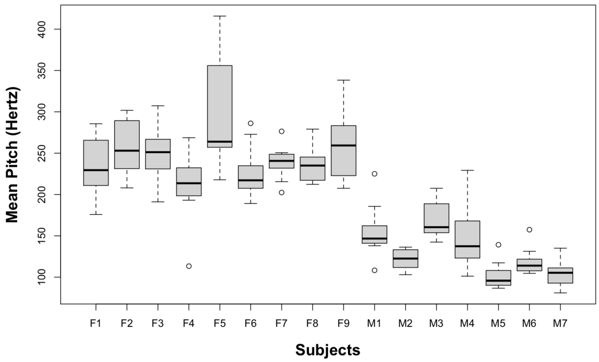
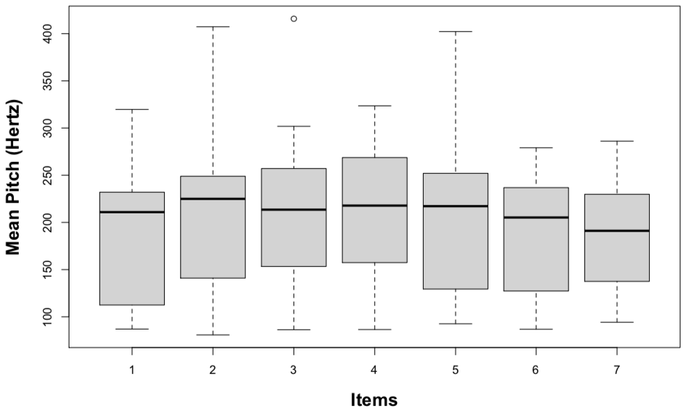

<big>

```{r, include=FALSE, message=F, warning=F}
library("knitr")
opts_chunk$set(echo = TRUE)
```

---

## Agenda {-}

* Mixed-Effects Modeling

---

## Load required packages and data {-}

```{r, message=F, warning=F}
if(!require(tidyverse)){install.packages("tidyverse")}
library(tidyverse)

if(!require(lme4)){install.packages("lme4")}
library(lme4)

politeness <- read_csv("http://www.bodowinter.com/uploads/1/2/9/3/129362560/politeness_data.csv")
```

# Mixed-Effects Modeling

One of the most common methods of statistical analysis in fields like sociolinguistics is mixed-effects (regression) modeling (MEM). As the full name implies, this is a type of regression model similar to linear regression, but with the addition of "mixed effects". 

I'm relying on this excellent tutorial by Bodo Winter on MEMs for the discussion in this section: <http://www.bodowinter.com/uploads/1/2/9/3/129362560/bw_lme_tutorial2.pdf>. The source data used is available from: <http://www.bodowinter.com/uploads/1/2/9/3/129362560/politeness_data.csv>. 

A few notes are in order before beginning:

1. The URL for the data file has changed since the .pdf was written -- I have updated it in the tutorial below to represent the current location. A copy is also currently available in a GitHub repository maintained by Hyuksu Ryu: <https://github.com/HyuksuRyu/mixedLM_tutorial>

1. The early part of the tutorial contains plots which were generated on a different dataset which is not publicly available, so I have simply added those here as image files. 

1. I have not been able to locate any source code for Winter's tutorial, so I have adapted his R code to run in Markdown. Because Winter did not use ggplot for his plots, I have also added ggplot equivalents alongside the original code -- you can decide which you like better!

1. I have not loaded any of the required packages or data inside the tutorial itself -- these have already been done in the preamble at the top of this document.

---

# A very basic tutorial for performing linear mixed effects analyses (Bodo Winter)

## Introduction: Fixed and random effects

In tutorial 1, we talked about how we could use the linear model to express the relationships in our data in terms of a function. In one example, we modeled pitch as a function of age.

>pitch ~ age + ε

We called “age” a fixed effect, and ε was our “error term” to represent the deviations from our predictions due to “random” factors that we cannot control experimentally. You could call this part the “probabilistic” or “stochastic” part of the model. Now, we’ll unpack this “ε” and add complexity to it. That is, we change the random aspect of our model, essentially leaving the systematic part unchanged. In mixed models, everything in the “systematic” part of your model works just like with linear models in tutorial 1.

In one of my studies, we have been interested in the relationship between pitch and politeness (Winter & Grawunder, 2012). So, essentially we’re aiming for a relationship that looks like something like this:

>pitch ~ politeness + ε

In our study, politeness was treated as a categorical factor with two levels... a formal register and an informal register. On top of that, we also had an additional fixed effect, sex, and so our formula looks more like this:

>pitch ~ politeness + sex + ε

So far so good. Now things get a little more complicated. Our design was so that we took multiple measures per subject. That is, each subject gave multiple polite responses and multiple informal responses. If we go back to the discussion of the assumptions of the linear model in tutorial 1, we can immediately see that this would violate the independence assumption: Multiple responses from the same subject cannot be regarded as independent from each other. Every person has a slightly different voice pitch, and this is going to be an idiosyncratic factor that affects all responses from the same subject, thus rendering these different responses inter-dependent rather than independent.

The way we’re going to deal with this situation is to add a random effect for subject. This allows us to resolve this non-independence by assuming a different “baseline” pitch value for each subject. So, subject 1 may have a mean voice pitch of 233 Hz across different utterances, and subject 2 may have a mean voice pitch of 210 Hz per subject. Here’s a visual depiction of how this looks like:

```{r echo = FALSE}

```

Subjects F1 to F9 are female subjects. Subjects M1 to M7 are male subjects. You immediately see that males have lower voices than females (as is to be expected). But on top of that, within the male and the female groups, you see lots of individual variation, with some people having relatively higher values for their sex and others having relatively lower values.

We can model these individual differences by assuming different random intercepts for each subject. That is, each subject is assigned a different intercept value, and the mixed model estimates these intercepts for you.

Now you begin to see why the mixed model is called a “mixed” model. The linear models that we considered so far have been “fixed-effects-only” models that had one or more fixed effects and a general error term “ε”. With the linear model, we essentially divided the world into things that we somehow understand or that are somehow systematic (the fixed effects, or the explanatory variables); and things that we cannot control for or that we don’t understand (ε). But crucially, this latter part, the unsystematic part of the model, did not have any interesting structure. We simply had a general across-the-board error term.

In the mixed model, we add one or more random effects to our fixed effects. These random effects essentially give structure to the error term “ε”. In the case of our model here, we add a random effect for “subject”, and this characterizes idiosyncratic variation that is due to individual differences.

The mixture of fixed and random effects is what makes the mixed model a mixed model.

Our updated formula looks like this:

>pitch ~ politeness + sex + (1|subject) + ε

“(1|subject)” looks a little enigmatic. I’m already using the R-typical notation format here. What this is saying is “assume an intercept that’s different for each subject” ... and “1” stands for the intercept here. You can think of this formula as telling your model that it should expect that there’s going to be multiple responses per subject, and these responses will depend on each subject’s baseline level. This effectively resolves the non-independence that stems from having multiple responses by the same subject.

Note that the formula still contains a general error term “ε”. This is necessary because even if we accounted for individual by-subject variation, there’s still going to be “random” differences between different utterances from the same subject.

O.k., so far so good. But we’re not done yet. In the design that we used in Winter and Grawunder (2012), there’s an additional source of non-independence that needs to be accounted for: We had different items. One item, for example, was an “asking for a favor” scenario. Here, subjects had to imagine asking a professor for a favor (polite condition), or asking a peer for a favor (informal condition). Another item was an “excusing for coming too late” scenario, which was similarly divided between polite and informal. In total, there were 7 such different items.

Similar to the case of by-subject variation, we also expect by-item variation. For example, there might be something special about “excusing for coming too late” which leads to overall higher pitch (maybe because it’s more embarrassing than asking for a favor), regardless of the influence of politeness. And whatever it is that makes one item different from another, the responses of the different subjects in our experiment might similarly be affected by this random factor that is due to item-specific idiosyncrasies. That is, if “excusing for coming to late” leads to high pitch (for whatever reason), it’s going to do so for subject 1, subject 2, subject 3 and so on. Thus, the different responses to one item cannot be regarded as independent, or, in other words, there’s something similar to multiple responses to the same item – even if they come from different people. Again, if we did not account for these interdependencies, we would violate the independence assumption.

Here’s a visual representation of the by-item variability:

```{r echo = FALSE}

```

The variation between items isn’t as big as the variation between subjects – but there are still noticeable differences, and we better account for them in our model!

We do this by adding an additional random effect:

>pitch ~ politeness + sex + (1|subject) + (1|item) + ε

So, on top of different intercepts for different subjects, we now also have different intercepts for different items. We now “resolved” those non-independencies (our model knows that there are multiple responses per subject and per item), and we accounted for by-subject and by-item variation in overall pitch levels.

Note the efficiency and elegance of this model. Before, people used to do a lot of averaging. For example, in psycholinguistics, people would average over items for a subjects-analysis (each data point comes from one subject, assuring independence), and then they would also average over subjects for an items- analysis (each data point comes from one item). There’s a whole literature on the advantages and disadvantages of this approach (Clark, 1973; Forster & Dickinson, 1976; Wike & Church, 1976; Raaijmakers, Schrijnemakers, & Gremmen, 1999; Raaijmakers, 2003; Locker, Hoffman, & Bovaird, 2007; Baayen, Davidson, & Bates, 2008; Barr, Levy, Scheepers, & Tilly, 2013).

The upshot is: while traditional analyses that do averaging are in principle legit, mixed models give you much more flexibility ... and they take the full data into account. If you do a subjects-analysis (averaging over items), you’re essentially disregarding by-item variation. Conversely, in the items-analysis, you’re disregarding by-subject variation. Mixed models account for both sources of variation in a single model. Neat, init?
Let’s move on to R and apply our current understanding of the linear mixed effects model!!

## Mixed models in R

For a start, we need to install the R package lme4 (Bates, Maechler & Bolker, 2012). While being connected to the internet, open R and type in:

>install.packages("lme4")

Select a server close to you. After installation, load the lme4 package into R with the following command:

>library(lme4)

Now, you have the function lmer() available to you, which is the mixed model equivalent of the function lm() in tutorial 1. This function is going to construct mixed models for us.

But first, we need some data! I put a shortened version of the dataset that we used for Winter and Grawunder (2012) onto my server. You can load it into R the following way:

>politeness= read.csv("http://www.bodowinter.com/uploads/1/2/9/3/129362560/politeness_data.csv")

Or you can download it by hand...
<http://www.bodowinter.com/tutorial/politeness_data.csv>
...and load it into R the following way:

>politeness = read.csv(file.choose( ))

Now, you have a data frame called politeness in your R environment. You can familiarize yourself with the data by using head(), tail(), summary(), str(), colnames()... or whatever commands you commonly use to get an overview of a dataset. Also, it is always good to check for missing values:

```{r}
which(is.na(politeness$frequency))
```

Or, alternatively, you can use the following:

```{r}
which(!complete.cases(politeness))
```

Apparently, there is a missing value in row 39. This is important to know but fortunately, a few missing values provide no problems for our mixed model analyses.

The difference in politeness level is represented in the column called “attitude”. In that column, “pol” stands for polite and “inf” for informal. Sex is represented as “F” and “M” in the column “gender”. The dependent measure is “frequency”, which is the voice pitch measured in Hertz (Hz). To remind you, higher values mean higher pitch.

The interesting random effects for us are in the column “subject” and “scenario”, the latter being the name of the item column (remember the different scenarios like “asking for a favor”?).

Let’s look at the relationship between politeness and pitch by means of a boxplot:

```{r warning=FALSE}
boxplot(frequency ~ attitude*gender,
        col=c("white","lightgray"),politeness)

politeness %>%
  ggplot(aes(x = gender, y = frequency, fill = attitude)) +
  geom_boxplot()
```

What do we see? In both cases, the median line (the thick line in the middle of the boxplot) is lower for the polite than for the informal condition. However, there may be a bit more overlap between the two politeness categories for males than for females.
Let’s start with constructing our model! Type in the command below ...

>lmer(frequency ~ attitude, data=politeness)

... and you will retrieve an error that should look like this:

>Error in mkReTrms(findbars(RHSForm(formula)), fr) :
  No random effects terms specified in formula

This is because the model needs a random effect (after all, “mixing” fixed and random effects is the point of mixed models). We just specified a single fixed effect, attitude, and that was not enough.

So, let’s add random intercepts for subjects and items (remember that items are called “scenarios” here):

```{r}
politeness.model = lmer(frequency ~ attitude + (1|subject) + (1|scenario), data=politeness)
```

The last command created a model that used the fixed effect “attitude” (polite vs. informal) to predict voice pitch, controlling for by-subject and by-item variability. We saved this model in the object politeness.model. Use summary() to display the full result:

```{r}
summary(politeness.model)
```

Again, let’s work through this: First, the output reminds you of the model that you fit. Then, there’s some general summary statistics such as Akaike’s Information Criterion, the log-Likelihood etc. We won’t go into the meaning of these different values in this tutorial because these are conceptually a little bit more involved. Let’s focus on the output for the random effects first:

Random effects:

|Groups|Name|Variance|Std.Dev.|
|---|---|---|---|
|scenario|(Intercept)|219|14.80|
|subject|(Intercept)|4015|63.36|
|Residual||646|25.42|

Have a look at the column standard deviation. This is a measure of how much variability in the dependent measure there is due to scenarios and subjects (our two random effects). You can see that scenario (“item”) has much less variability than subject. Based on our boxplots from above, where we saw more idiosyncratic differences between subjects than between items, this is to be expected. Then, you see “Residual” which stands for the variability that’s not due to either scenario or subject. This is our “ε” again, the “random” deviations from the predicted values that are not due to subjects and items. Here, this reflects the fact that each and every utterance has some factors that affect pitch that are outside of the purview of our experiment.

The fixed effects output mirrors the coefficient table that we considered in tutorial 1 when we talked about the results of our linear model analysis.

Fixed effects:

| |Estimate|Std. Error|t value|
|---|---|---|---|
|(Intercept)|202.588|26.754|7.572|
|attitudepol|-19.695|5.585|-3.527|

The coefficient “attitudepol” is the slope for the categorical effect of politeness. Minus 19.695 means that to go from “informal” to “polite”, you have to go down -19.695 Hz. In other words: pitch is lower in polite speech than in informal speech, by about 20 Hz. Then, there’s a standard error associated with this slope, and a t- value, which is simply the estimate (20 Hz) divided by the standard error (check this by performing the calculation by hand).

Note that the lmer() function (just like the lm() function in tutorial 1) took whatever comes first in the alphabet to be the reference level. “inf” comes before “pol”, so the slope represents the change from “inf” to “pol”. If the reference category would be “pol” rather than “inf”, the only thing that would change would be that the sign of the coefficient 19.695 would be positive. Standard errors, significance etc. would remain the same.

Now, let’s consider the intercept. In tutorial 1, we already talked about the fact that oftentimes, model intercepts are not particularly meaningful. But this intercept is especially weird. It’s 202.588 Hz ... where does that value come from?

If you look back at the boxplot that we constructed earlier, you can see that the value 202.588 Hz seems to fall halfway between males and females (in the informal condition) – and this is indeed what this intercept represents. It’s the average of our data for the informal condition.

As we didn’t inform our model that there’s two sexes in our dataset, the intercept is particularly off, in between the voice pitch of males and females. This is just like the classic example of a farm with a dozen hens and a dozen cows ... where the mean legs of all farm animals considered together is three, not a particularly informative representation of what’s going on at the farm.

Let’s add gender as an additional fixed effect:

```{r}
politeness.model = lmer(frequency ~ attitude +
                          gender + (1|subject) +
                          (1|scenario), data=politeness)
```

We overwrote our original model object politeness.model with this new model. Note that we added “gender” as a fixed effect because the relationship between sex and pitch is systematic and predictable (i.e., we expect females to have higher pitch). This is different from the random effects subject and item, where the relationship between these and pitch is much more unpredictable and “random”. We’ll talk more about the distinction between fixed and random effects later.

Let’s print the model output again:

```{r}
summary(politeness.model)
```

Let’s have a look at the residuals first:

Random effects:

|Groups|Name|Variance|Std.Dev.|
|---|---|---|---|
|scenario|(Intercept)|219.3|14.81|
|subject|(Intercept)|615.7|24.81|
|Residual||645.9|25.41||

Note that compared to our earlier model without the fixed effect gender, the variation that’s associated with the random effect “subject” dropped considerably. This is because the variation that’s due to gender was confounded with the variation that’s due to subject. The model didn’t know about males and females, and so its predictions were relatively more off, creating relatively larger residuals. Now that we have added the effect of gender, we have shifted a considerable amount of the variance that was previously in the random effects component (differences between male and female individuals) to the fixed effects component.

Let’s look at the coefficient table now:

Fixed effects:

||Estimate|Std. Error|t value|
|---|---|---|---|
|(Intercept)|256.846|16.116|15.937|
|attitudepol|-19.721|5.584|-3.532|
|genderM|-108.516|21.015|-5.164|

We see that males and females differ by about 109 Hz. And the intercept is now much higher (256.846 Hz), as it now represents the female category (for the informal condition). The coefficient for the effect of attitude didn’t change much.

## Statistical significance

So far, we haven’t talked about significance yet. But, if you want to publish this, you’ll most likely need to report some kind of p-value. Unfortunately, p-values for mixed models aren’t as straightforward as they are for the linear model. There are multiple approaches, and there’s a discussion surrounding these, with sometimes wildly differing opinions about which approach is the best. Here, I focus on the Likelihood Ratio Test as a means to attain p-values.

Likelihood is the probability of seeing the data you collected given your model. The logic of the likelihood ratio test is to compare the likelihood of two models with each other. First, the model without the factor that you’re interested in (the null model), then the model with the factor that you’re interested in. Maybe an analogy helps you to wrap your head around this: Say, you’re a hiker, and you carry a bunch of different things with you (e.g., a gallon of water, a flashlight). To know whether each item affects your hiking speed, you need to get rid of it. So, you get rid of the flashlight and run without it. Your hiking speed is not affected much. Then, you get rid of the gallon of water, and you realize that your hiking speed is affected a lot. You would conclude that carrying a gallon of water with you significantly affects your hiking speed whereas carrying a flashlight does not. Expressed in formula, you would want to compare the following two “models” (think “hikes”) with each other:

>mdl1 = hiking speed ~ gallon of water + flashlight 
>mdl2 = hiking speed ~ flashlight

If there is a significant difference between “mdl2” and “mdl1”, then you know that the gallon of water matters. To assess the effect of the flashlight, you would have to do a similar comparison:

>mdl1 = hiking speed ~ gallon of water + flashlight 
>mdl2 = hiking speed ~ gallon of water

In both cases, we compared a full model (with the fixed effects in question) against a reduced model without the effects in question. In each case, we conclude that a fixed effect is significant if the difference between the likelihood of these two models is significant.

Here’s how you would do this in R. First, you need to construct the null model:

```{r}
politeness.null = lmer(frequency ~ gender + (1|subject) + (1|scenario), data=politeness, REML=FALSE)
```

Note one additional technical detail. I just added the argument REML=FALSE. Don’t worry about it too much – but in case you’re interested, this changes some internal stuff (in particular, the likelihood estimator), and it is necessary to do this when you compare models using the likelihood ratio test (Pinheiro & Bates, 2000; Bolker et al., 2009).

Then, we re-do the full model above, this time also with REML=FALSE:

```{r}
politeness.model = lmer(frequency ~ attitude + gender + (1|subject) + (1|scenario), data=politeness, REML=FALSE)
```

Now you have two models to compare with each other – one with the effect in question, one without the effect in question. We perform the likelihood ratio test using the anova() function:

```{r}
anova(politeness.null,politeness.model)
```

You’re being reminded of the formula of the two models that you’re comparing. Then, you find a Chi-Square value, the associated degrees of freedom and the p-value.

>You might wonder why we’re doing a Chi-Square test here. There’s a lot of technical detail here, but the main thing is that there’s a theorem, called Wilk’s Theorem, which states that negative two times the log likelihood ratio of two models approaches a Chi-Square distribution with degrees of freedom of the number of parameters that differ between the models (in this case, only “attitude”). So, somebody has done a proof of this and you’re good to go! Do note, also, that some people don’t like “straight-jacketing” likelihood into the classical null-hypothesis significance testing framework that we’re following here, and so they would disagree with the interpretation of likelihood the way we used it in the likelihood ratio test.

You would report this result the following way:

>“... politeness affected pitch (χ2(1)=11.62, p=0.00065), lowering it by about 19.7 Hz ± 5.6 (standard errors) ...”

If you’re used to t-tests, ANOVAs and linear model stuff, then this likelihood-based approach might seem weird to you. Rather than getting a p-value straightforwardly from your model, you get a p-value from a comparison of two models. To help you get used to the logic, remember the hiker and the analogy of putting one piece of luggage away to estimate that piece’s effect on hiking speed.

Note that we kept the predictor “gender” in the model. The only change between the full model and the null model that we compared in the likelihood ratio test was the factor of interest, politeness. In this particular test, you can think of “gender” as a control variable and of “attitude” as your test variable.

We could have also compared the following two models:

>full model: frequency ~ attitude + gender 
>reduced model: frequency ~ 1

“mdl.null” in this case is an intercept only model, where you just estimate the mean of the data. You could compare this to “mdl.full”, which has two more effects, “attitude” and “gender”. If this difference became significant, you would know that “mdl.full” and “mdl.null” are significantly different from each other – but you would not know whether this difference is due to “attitude” or due to “gender”. Coming back to the hiker analogy, it is as if you dropped both the gallon of water and the flashlight and then you realized that your hiking speed changed, but you wouldn’t be able to determine conclusively which one of the two pieces of luggage was the crucial one.

A final thing regarding likelihood ratio tests: What happens if you have an interaction? We didn’t talk much about interactions yet, but say, you predicted “attitude” to have an effect on pitch that is somehow modulated through “gender”. For example, it could be that speaking politely versus informally has the opposite effect for men and women. Or it could be that women show a difference and men don’t (or vice versa). If you have such an inter-dependence between two factors (called an interaction), you can test it the following way:

>full model: frequency ~ attitude*gender 
>reduced model: frequency ~ attitude + gender

In R, interactions between two factors are specified with a “*” rather than a “+”.

If you compare the above models in a likelihood ratio test using the anova() function, then you would get a p-value that gives you the significance of the interaction. If this comparison is significant, you know that attitude and gender are significantly inter-dependent on each other. If this is comparison is not significant, there is no significant inter-dependence.

It might be a good idea to try out different likelihood comparisons with the data provided above, say “attitude*gender” versus “attitude + gender” versus simply “1” (the intercept only model). Remember to always put REML=FALSE when creating your model.

## Super-crucial: Random slopes versus random intercepts

We’re not done yet. One of the coolest things about mixed models is coming up now, so hang on!!

Let’s have a look at the coefficients of the model by subject and by item:

```{r}
coef(politeness.model)
```

You see that each scenario and each subject is assigned a different intercept. That’s what we would expect, given that we’ve told the model with “(1|subject)” and “(1|scenario)” to take by-subject and by-item variability into account.

But not also that the fixed effects (attitude and gender) are all the same for all subjects and items. Our model is what is called a random intercept model. In this model, we account for baseline-differences in pitch, but we assume that whatever the effect of politeness is, it’s going to be the same for all subjects and items.

But is that a valid assumption? In fact, often times it’s not – it is quite expected that some items would elicit more or less politeness. That is, the effect of politeness might be different for different items. Likewise, the effect of politeness might be different for different subjects. For example, it might be expected that some people are more polite, others less. So, what we need is a random slope model, where subjects and items are not only allowed to have differing intercepts, but where they are also allowed to have different slopes for the effect of politeness. This is how we would do this in R:

```{r}
politeness.model = lmer(frequency ~ attitude + gender + (1+attitude|subject) + (1+attitude|scenario), data=politeness, REML=FALSE)
```

Note that the only thing that we changed is the random effects, which now look a little more complicated. The notation “(1+attitude|subject)” means that you tell the model to expect differing baseline-levels of frequency (the intercept, represented by 1) as well as differing responses to the main factor in question, which is “attitude” in this case. You then do the same for items.
Have a look at the coefficients of this updated model by typing in the following:

```{r}
coef(politeness.model)
```

Now, the column with the by-subject and by-item coefficients for the effect of politeness (“attitudepol”) is different for each subject and item. Note, however, that it’s always negative and that many of the values are quite similar to each other. This means that despite individual variation, there is also consistency in how politeness affects the voice: for all of our speakers, the voice tends to go down when speaking politely, but for some people it goes down slightly more so than for others.

Have a look at the column for gender. Here, the coefficients do not change. That is because we didn’t specify random slopes for the by-subject or by-item effect of gender.

O.k., let’s try to obtain a p-value. We keep our model from above (politeness.model) and compare it to a new null model in a likelihood ratio test. Let’s construct the null model first:

>politeness.null = lmer(frequency ~ gender + (1+attitude|subject) + (1+attitude|scenario), data=politeness, REML=FALSE)

>**Note:** This model fails to run -- I'm not sure why, but something in the structure of Winter's datafile may have changed after the .pdf was made.

Note that the null model needs to have the same random effects structure. So, if your full model is a random slope model, your null model also needs to be a random slope model.
Let’s now do the likelihood ratio test:

>anova(politeness.null,politeness.model)

This is, again, significant.

There are a few important things to say here: You might ask yourself “Which random slopes should I specify?” ... or even “Are random slopes necessary at all?”

A lot of people construct random intercept-only models but conceptually, it makes hella sense to include random slopes most of the time. After all, you can almost always expect that people differ with how they react to an experimental manipulation! And likewise, you can almost always expect that the effect of an experimental manipulation is not going to be the same for all items.

Moreover, researchers in ecology (Schielzeth & Forstmeier, 2009), psycholinguistics (Barr, Levy, Scheepers, & Tilly, 2013) and other fields have shown via simulations that mixed models without random slopes are anti-conservative or, in other words, they have a relatively high Type I error rate (they tend to find a lot of significant results which are actually due to chance).

Barr et al. (2013) recommend that you should “keep it maximal” with respect to your random effects structure, at least for controlled experiments. This means that you include all random slopes that are justified by your experimental design ... and you do this for all fixed effects that are important for the overall interpretation of your study.

In the model above, our whole study crucially rested on stating something about politeness. We were not interested in gender differences, but they are well worth controlling for. This is why we had random slopes for the effect of attitude (by subjects and item) but not gender. In other words, we only modeled by-subject and by-item variability in how politeness affects pitch.

## Assumptions

In tutorial 1, we talked a lot about the many different assumptions of the linear model. The good news is: Everything that we discussed in the context of the linear model applies straightforwardly to mixed models. So, you also have to worry about collinearity and influential data points. And you have to worry about homoscedasticity (and potentially about lack of normality). But you don’t have to learn much new stuff. The way you check these assumptions in R is exactly the same as in the case of the linear model, say, by creating a residual plot, a histogram of the residuals or a Q-Q plot.

Independence, being the most important assumption, requires a special word: One of the main reasons we moved to mixed models rather than just working with linear models was to resolve non-independencies in our data. However, mixed models can still violate independence ... if you’re missing important fixed or random effects. So, for example, if we analyzed our data with a model that didn’t include the random effect “subject”, then our model would not “know” that there are multiple responses per subject. This amounts to a violation of the independence assumption. So choose your fixed effects and random effects carefully, and always try to resolve non-independencies.

Then, a word on influential data points. You will find that the function dfbeta() that we used in the context of linear models doesn’t work for mixed models. If you worry about influential points, you can check out the package influence.ME (Nieuwenhuis, te Grotenhuis, & Pelzer, 2012), or you can program a for loop that does the leave-one-out diagnostics by hand. The following code gives you an outline of the general structure of how you might want to do this (you can check my “doodling” tutorials on loops and programming structures in R to get a better grasp of this):

>all.res=numeric(nrow(mydataframe))
for(i in 1:nrow(mydataframe)){
  myfullmodel=lmer(response~predictor+
    (1+predictor|randomeffect),POP[-i,])
all.res[i]=fixef(myfullmodel)[some number]
}

>The basic idea of this code snippet is this: Pre-define a vector that has as many elements as you have rows in your dataset. Then, cycle through each row. For each iteration, make a new mixed model without that row (this is achieved by POP[-i,]). Then, the function fixef() extracts whatever coefficient interests you. You will need to adapt this code to your analysis. Besides the names of your data frame and your variables, you need to run fixef() on your model once so you know which position the relevant coefficient is. In our case, I would put a “2” in there because the effect of “attitudepol” appears second in the list of coefficients. “1” would give me the intercept, always the first coefficient mentioned in the coefficient table.

Go ahead and play with checking the assumptions. You can go back to tutorial 1 and apply the code in there to the new mixed model objects in this tutorial.

## A final note on random versus fixed effects

I have evaded a precise definition of the difference between fixed and random effects. I deliberately did this because I wanted you to get some experience with linear mixed effects models in R before we finally take a step back and sharpen our concepts.

So, a random effect is generally something that can be expected to have a non- systematic, idiosyncratic, unpredictable, or “random” influence on your data. In experiments, that’s often “subject” and “item”, and you generally want to generalize over the idiosyncrasies of individual subjects and items.

Fixed effects on the other hand are expected to have a systematic and predictable influence on your data.

But there’s more to it. One definition of fixed effects says that fixed effects “exhaust the population of interest”, or they exhaust “the levels of a factor”. Think back of sex. There’s only “male” or “female” for the variable “gender” in our study, so these are the only two levels of this factor. Our experiment includes both categories and thus exhausts the category sex. With our factor “politeness” it’s a bit trickier. You could imagine that there are more politeness levels than just the two that we tested. But in the context of our experiment, we operationally defined politeness as the difference between these two categories – and because we tested both, we fully “exhaust” the factor politeness (as defined by us).

In contrast, random effects generally sample from the population of interest. That means that they are far away from “exhausting the population” ... because there’s usually many many more subjects or items that you could have tested. The levels of the factor in your experiment is a tiny subset of the levels “out there” in the world.

## The write-up

A lot of tutorials don’t cover how to write up your results. And that’s a pity, because this is a crucial part of your study!!!

The most important thing: You need to describe the model to such an extent that people can reproduce the analysis. So, a useful heuristic for writing up your results is to ask yourself the question “Would I be able to re-create the analysis given the information that I provided?” If the answer is “yes” your write-up is good.

In particular, this means that you specify all fixed effects and all random effects, and you should also mention whether you have random intercepts or random slopes.

For reporting individual results, you can stick to my example with the likelihood ratio test above. Remember that it’s always important to report the actual coefficients/estimates and not just whether an effect is significant. You should also mention standard errors.

Another important thing is to give enough credit to the people who put so much of their free time into making lme4 and R work so efficiently. So let’s cite them! It’s also a good idea to cite exactly the version that you used for your analysis. You can find out your version and who to cite by typing in...

```{r}
citation()
```

... for your R-version ... and ...

```{r}
citation("lme4")
```

... for the lme4 package.

Finally, it’s important that you mention that you checked assumptions, and that the assumptions are satisfied.

So here’s what I would have written for the analysis that we performed in this tutorial:

>“We used R (R Core Team, 2012) and lme4 (Bates, Maechler & Bolker, 2012) to perform a linear mixed effects analysis of the relationship between pitch and politeness. As fixed effects, we entered politeness and gender (without interaction term) into the model. As random effects, we had intercepts for subjects and items, as well as by-subject and by-item random slopes for the effect of politeness. Visual inspection of residual plots did not reveal any obvious deviations from homoscedasticity or normality. P-values were obtained by likelihood ratio tests of the full model with the effect in question against the model without the effect in question.”

Yay, we’re done!! I hope this tutorial was of help to you. I want to thank the many people who taught me stats (in particular Roger Mundry), and the many readers of this tutorial who gave feedback to earlier versions. Finally, I want to thank you for joining me on this quick tour through mixed models.

</big>